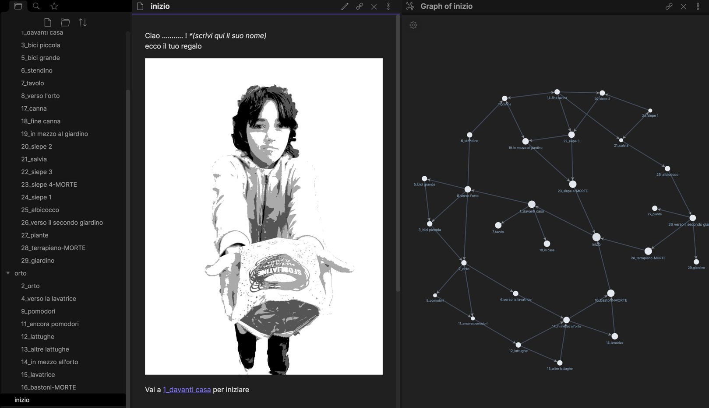

ciao (il tuo nome)!  
ecco il mio regalo per te.  
cosa vuoi fare ora?  

- se non ti interessa, continua a scorrere la bacheca.
- se vuoi aprirlo ora, continua a leggere qui

---
questo è l’incipit di un libro “interattivo”, ovvero dove il lettore interagisce, prende parte, fa scelte durante la narrazione saltando di pagina in pagina come su una ragnatela. non è un normale lettore/spettatore passivo.

mio figlio sta creando un LibroGame speciale come regalo al fratellino, io lo sto aiutando con le questioni tecniche e di produzione, ed è per me un momento di riflessione sul tema dell’Interattività che mi accompagna ormai da decenni.

Conosciamo una storia dove noi siamo davvero i protagonisti e facciamo scelte in base a quello che percepiamo e pensiamo?
Una storia le cui pagine sono scritte da altri, ma che scegliamo noi quali leggere?
Cosa c’è di più storicamente interattiva della nostra vita?

Da umanista, considero il gioco uno strumento di eccellenza per studiare, approfondire, ricreare il senso della vita umana: il giocatore, noi, siamo parte interagente con il sistema che percepiamo, con la storia che “scorre davanti ai nostri occhi”

Per questo ho gran piacere a iniziare così questo percorso che ci porterà ad esplorare l’infinito mondo del gioco e dell’essere umani.
Inizierò a raccontare come stiamo creando questo libro gioco

accetti il nostro regalo?

