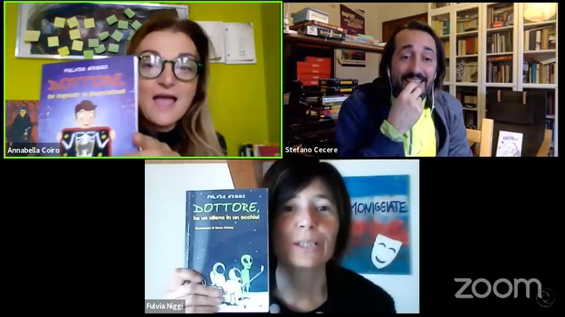

ecco il video dell'evento di oggi "AIUTO HO INGOIATO UNO YOUTUBER!" 
dove con Annabella Coiro e Fulvia Niggi durante BookCity Milano ([link](https://bookcitymilano.it/eventi/2020/aiuto-ho-ingoitato-uno-youtuber-8-12-anni)) abbiamo parlato di videogiochi, social media, youtubers, genitorialità, insegnamento, giochi in scatola e molto altro!
PS: non siamo riusciti a tagliare i primi 40 secondi di video vabbeh 🙂

<https://www.youtube.com/watch?v=hSE_OQgnDWI>

