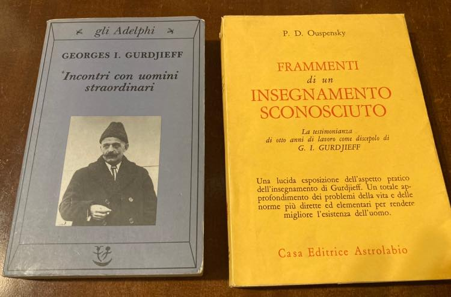

una domanda per gli amici virtuali: 
- conoscete Gurdjieff?
- avete mai letto uno di questi libri?

lo chiedo perché è un personaggio ormai secolare, e sono curioso di quanti l’abbiamo scoperto, se se ne parla ancora, quanto è attuale. 

alcuni musicisti (ad esempio Battiato in Italia) l’hanno fatto conoscere. gli attuali Tlon si ispirano molto a lui. molti forse lo conoscono indirettamente, avendo egli sincretizzato moltissimo del pensiero psicologico contemporaneo. 
se lo conoscete: cosa ne pensate?

così, è giusto una curiosità, se volete ne possiamo chiacchierare nei commenti o ancora meglio in un caffè appena si diventa bianchi
