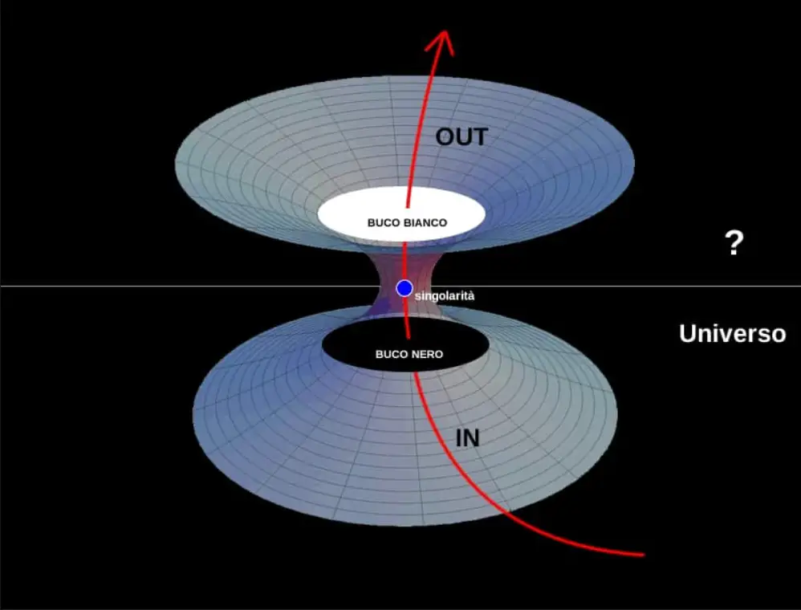

prendi tutta la Terra e comprimila alla dimensione di una palla da ping pong. 
ecco la massa di un Buco Nero. ce ne sono milioni solo nella nostra Galassia. 
questa massa compressa non rimane ferma ma inizia subito ad espandersi velocemente. 
ecco il Buco Bianco.

ma il tempo si è dilatato così tanto che ai nostri occhi di osservatore lontano questa espansione durerà miliardi di anni. 

avventurarsi nel mondo della fisica non è più una questione da nerd, bensì immergersi nelle questioni esistenziali.
e non diciamo di non averne tempo 

