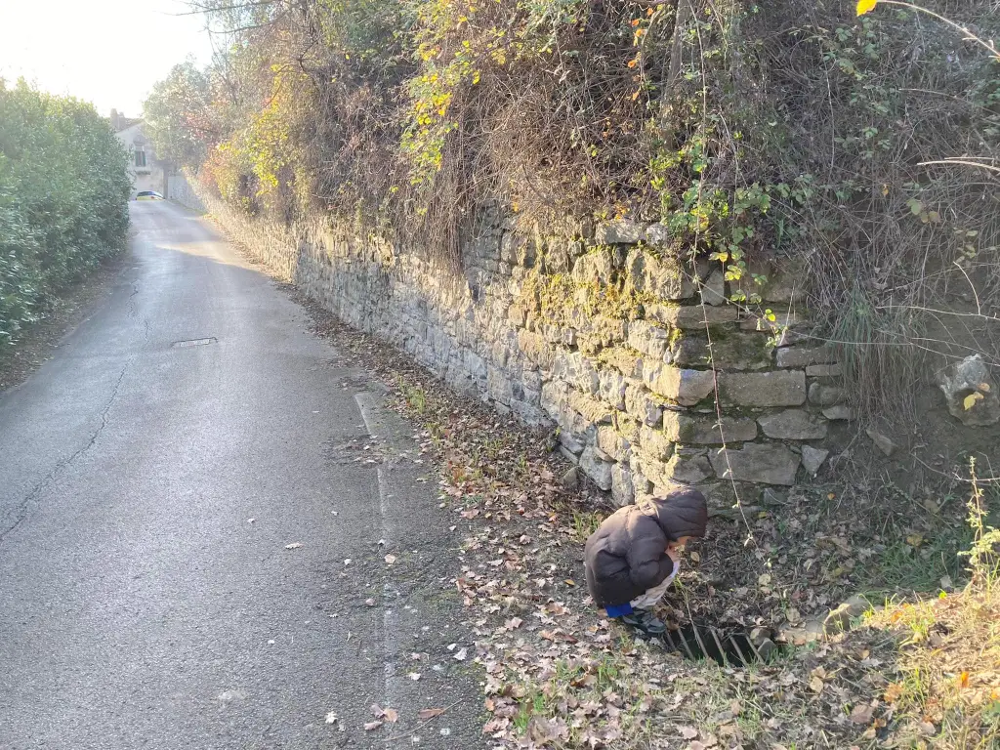

- sarà morto?
- [i rospi muoiono anche di freddo se non schiacciati o mangiati] ma no, è andato in letargo e dorme fino a primavera
- gli butto delle foglie così sta più protetto
- bene
- e perché non gli costruiamo un elmo in plastica?
- [se compravi quella stampante 3D in offerta…] ehh e perché?
- per difendersi dai cinghiali!
- [lui è più altruista di te] anche io sono… ma come sei altruista! quando uscirà vedremo
- ma da dove esce? di certo non può saltare fin quassù 
- no c’è un tubo di collegamento per lo scolo dell’acqua. lui entra ed esce da lì.
- ci andiamo così lo vado a prendere e lo portiamo a casa nostra?
- noooo come Bishop! [non avete ancora visto Alien 2 ricordati ha solo 6 anni] nooo non puoi strisciare dentro un tubo così stretto e poi Bufo vuole stare tranquillo fino a primavera 
- ok. ancora una fogliolina allora. 
