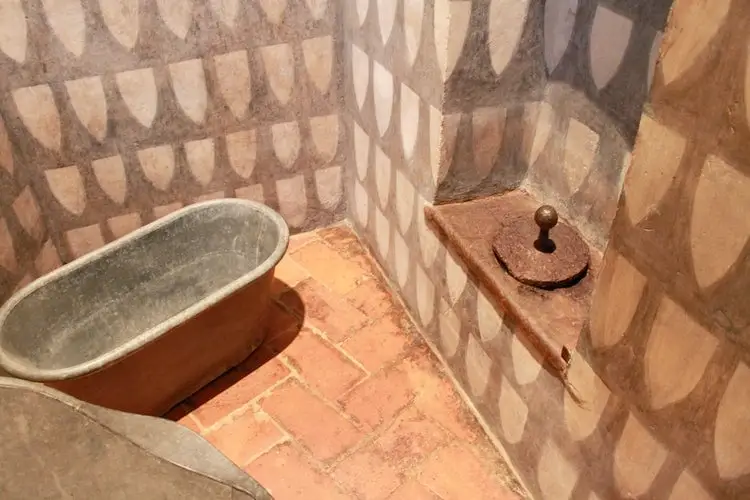

CESSO
- hai chiuso il vater?
- no
- ma perché sia chiama vater?
- ahh bravo bella domanda: per errore! dovremmo chiamarlo Water.. da acqua in inglese.. perché il nome completo sarebbe Water Closet (W.C. come lo scrivono sempre). sapete perché?
- uhmmmm
- perché c'è l'acqua?
- si, nel gabinetto è essenziale l'acqua. sapete che la storia del dove facciamo la cacca è molto antica.. e la tecnologia e la scienza delle fogne ha accompagnato lo sviluppo delle città e delle nostre case
- anche i primitivi avevano il vater?
- ve li immaginata nelle antiche caverne. ti svegliavi.. e che facevi? mica la facevi nella caverna che poi vivevi nel gran puzzo.. andavi fuori no?
- a parte la puzza, sapete che una volta non si sapeva che le fogne potessero portare malattie per via dei batteri.. di fatto c'era il fiume della fogna in mezzo alla strada a cielo aperto e le nostre quattro cacche di cane che troviamo in confronto sono dei confetti rosa 
- mi ricordo quando andammo a quel castello c'era il buco che faceva cadere la cacca fuori dalle mura
- vero!
- il bello è che ci sono tanti nomi per il bagno... ora non so perché qui lo chiamiamo con il nome inglese.. in francese è toilette, i romani lo chiamavano CESSO
- CESSO?
- la parola deriva dal latino "secessus" che significa “appartato”
- qualcuno usa questa parola per le cose brutte
- e si, è diventata quasi una parolaccia.. di fatto indica cose che stanno distanti o che si vogliono che stiano lontane per non sentirne la puzza
- al Liceo impareremo tutte queste parole?
- uhmm non lo so, perché vedi quanto sapere un po' di latino permette di capire la nostra storia!
