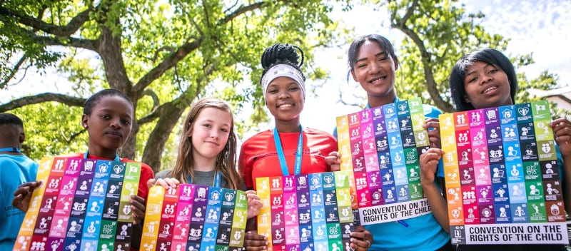

Inauguro la sezione Pedagogia dello Studio, con quella che è, o almeno dovrebbe essere, la bibbia dei bambini e degli adolescenti: la **Convenzione dei Diritti Infanzia**.

Non sapevo fosse così recente (1989) e che l'avessero ratificata praticamente tutti gli stati del mondo: 196, tranne Stati Uniti. Incredibile, vero? indagherò sulle loro motivazioni.

I quattro principi fondamentali della Convenzione sono:

1. **Non discriminazione** (art. 2): i diritti sanciti dalla Convenzione devono essere garantiti a tutti i minorenni, senza distinzione di razza, sesso, lingua, religione, opinione del bambino/adolescente o dei genitori. 
2. **Superiore interesse** (art. 3): in ogni legge, provvedimento, iniziativa pubblica o privata e in ogni situazione problematica, l'interesse del bambino/adolescente deve avere la priorità. 
3. **Diritto alla vita, alla sopravvivenza e allo sviluppo del bambino e dell'adolescente** (art. 6): gli Stati devono impegnare il massimo delle risorse disponibili per tutelare la vita e il sano sviluppo dei bambini, anche tramite la cooperazione internazionale. 
4. **Ascolto delle opinioni del minore** (art. 12): prevede il diritto dei bambini a essere ascoltati in tutti i processi decisionali che li riguardano, e il corrispondente dovere, per gli adulti, di tenerne in adeguata considerazione le opinioni.

Il documento completo è qui: [convenzione-diritti-infanzia](https://2042ed.org/notes/biblioteca/convenzione-diritti-infanzia/)
