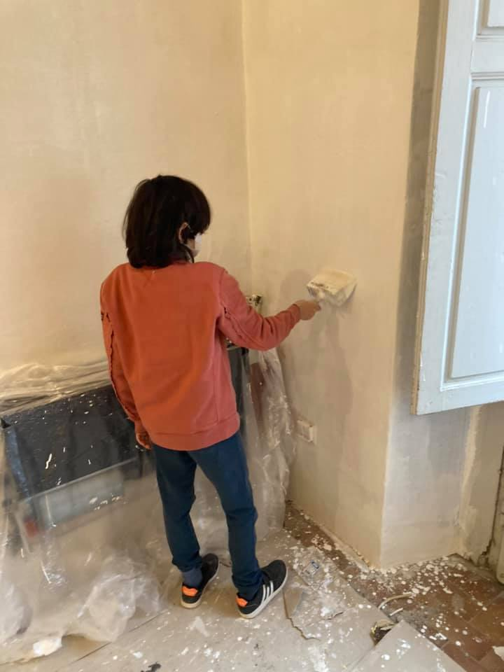

io davvero non capisco chi cerca la gratificazione nel distruggere le cose degli altri (spesso per invidia) o nel fare le cose giusto per godersi il plauso
se penso ai momenti in cui mi sono sentito più gratificato, i casi sono tre:

1. si è aiutato qualcuno
2. si è superato un limite personale
3. si è costruito qualcosa

a me sembrano meccanismi consolidati e abbastanza condivisi.
ergo è interessante _mettere altri_ nelle condizioni di: 

1. aiutare qualcuno (tipo aiuta tuo fratello a superare una difficoltà)
2. superare un limite (pensi di non essere in grado di fare una cosa, ma ti faccio vedere che invece ce la fai)
3. costruire qualcosa (la parete la imbianchi tu vedrai che soddisfazione)
magari quella cosa potevo farla io, magari più velocemente e meglio, ma se io aiuto te a superare un tuo limite per costruire qualcosa, abbiamo fatto bingo e stiamo costruendo un mondo migliore per tutti.. orgasmotron!

convenite?
