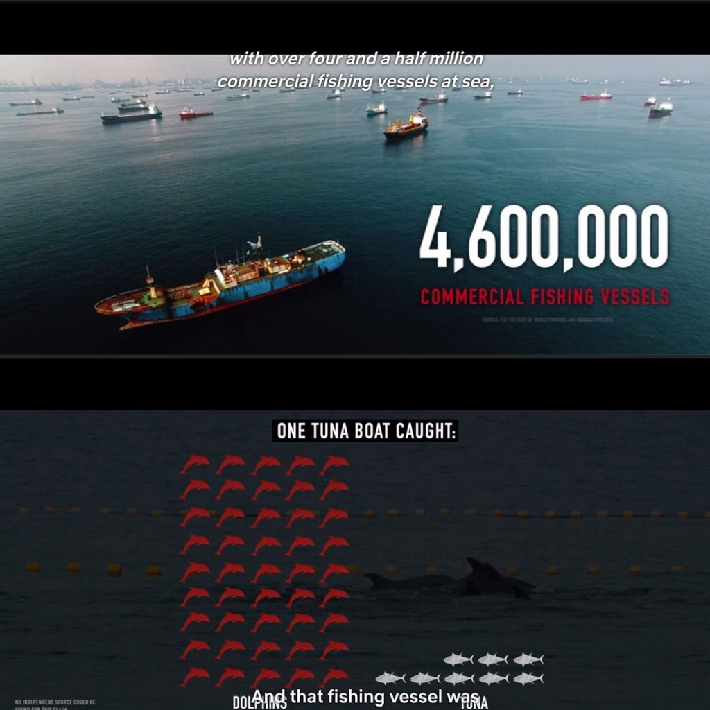

- ci sono 4.600.000 navi commerciali da pesca in mare
- si
- e qui vediamo che una di queste per pescare 8 **tonni**, uccide fino a 45 **delfini** 
- e si.. è un effetto collaterale.. ma a volte i delfini vengono uccisi di proposito perché mangiano troppi pesci
- ahh.. ma quella nave aderisce e mostra nelle etichette dei suoi prodotti il marchio "Dolphin Safe", ovvero garantisce che nessun delfino è stato ucciso
- eh si. ma una volta in mare, noi non possiamo controllare nessuno
- non mandate dei controllori?
- ogni tanto. ma possono essere corrotti. e comunque ne abbiamo pochissimi.. siamo una associazione no profit
e così via con mille altre considerazioni sui nostri mari e l'economia che li domina
**Seaspiracy** è un ottimo documentario (su Netflix)
E' davvero il momento di passare tutti ad un'alimentazione vegetariana/vegana, promuovendo massivamente anche la carne artificiale