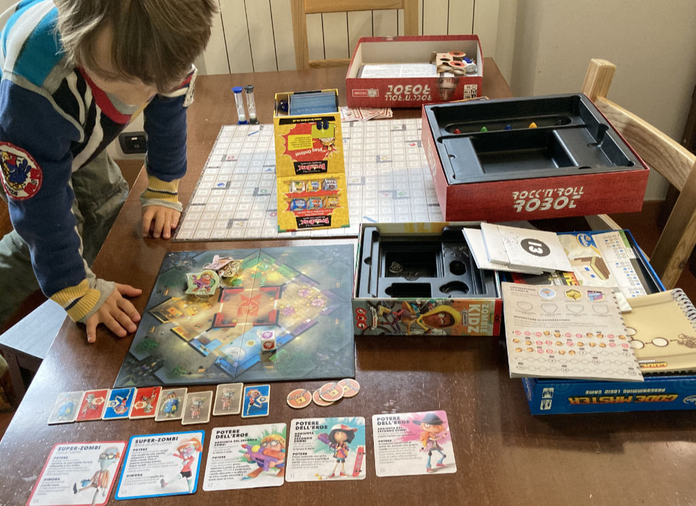
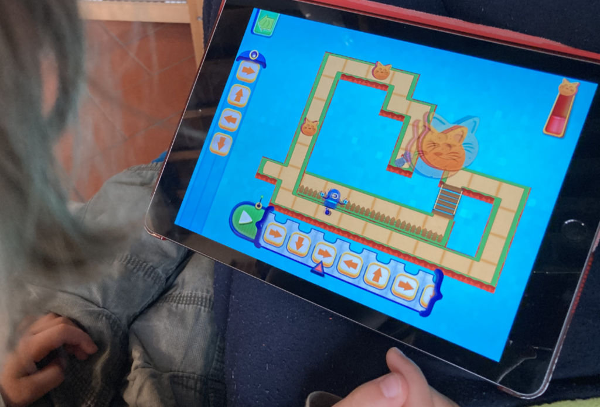
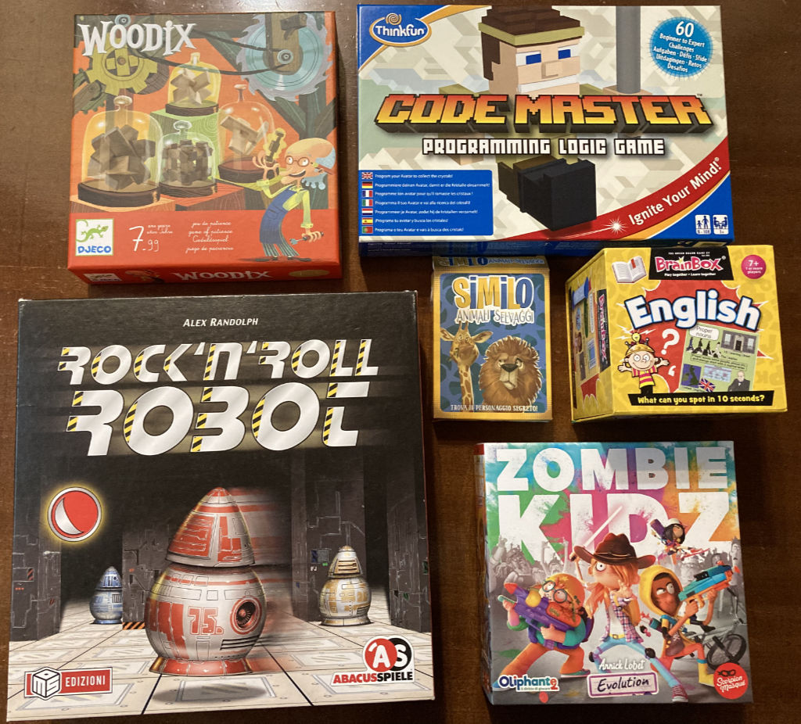
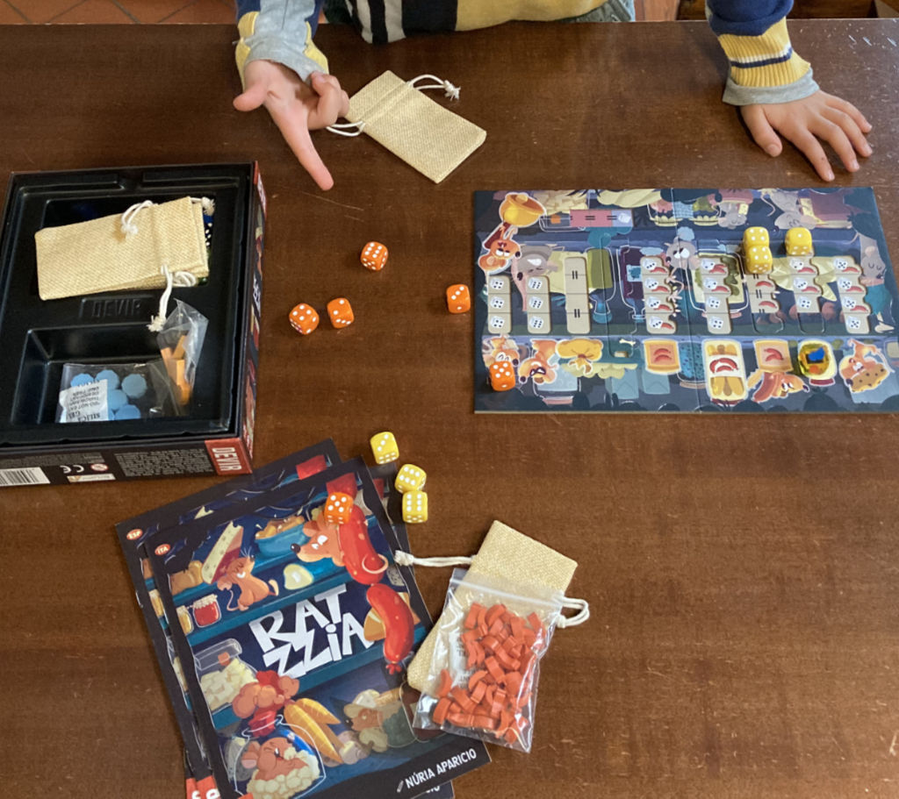

> colgo l'occasione di questo post per testare i link alle schede dei giochi di PlayED, la nostra guida del giocare e imparare

Bruno è ancora a casa e la mattina è lunga.
Con un tempo polare che volge alla neve e il fratellone isolato a studiare, cerchiamo di ricreare una situazione "scolastica", tanto so che non posso fare altro e non voglio abbandonarlo ai devices.

Metto sul tavolo un po' di giochi e gli si illuminano subito gli occhi a vedere i Woodix. iniziamo bene :)

In un paio d'ore giocheremo con questi giochi
- [Woodix](https://2042ed.org/played/boardgame/woodix/) per la manualità e tridimensionalità
- [Rock Roll Robots](https://2042ed.org/played/boardgame/rock-roll-robot/) per la logica e immaginazione
- [Code Master](https://2042ed.org/played/steam/codemaster/) per la progettazione di soluzioni
- [Similo](https://2042ed.org/played/boardgame/similo/) per l'osservazione
- [Zombie Kids](https://2042ed.org/played/boardgame/zombie-kids-evolution/) perché è divertentissimo ed è cooperativo
- [Brain Box English](https://2042ed.org/played/boardgame/brainbox/) per ripassare due parole di inglese
- [Ratzzia](https://2042ed.org/played/boardgame/ratzzia/) per un po' di matematica con i dadi

In modo abbastanza informale, ma l'attenzione è buona!

E per finire un po' di "sacro" **tablet**, dove ha finito l'ultimo livello di _Code a Pillar_ (un semplice gioco dove pre-programmi il bruco a mangiare le foglie e ti insegna qualche parola in inglese), e quindi si è guadagnato il ben più evoluto e divertente _Code the Robot - Save the Cat_ dove programmi il robot per andare a salvare il gattino.. divertente, fatto benissimo! ne parliamo qui:

- [Ed Apps per Tablet](https://2042ed.org/played/videogame/tablet-kids-ed-games/)

Il mio ruolo di eDad è stato fondamentale, ma divertente e non troppo difficile, una volta che si hanno un po' di giochi che stimolano al punto giusto.

PS: mi piace molto il ruolo di **eDaD** (Ed + Dad + DAD + D&D :)

## Gallery

