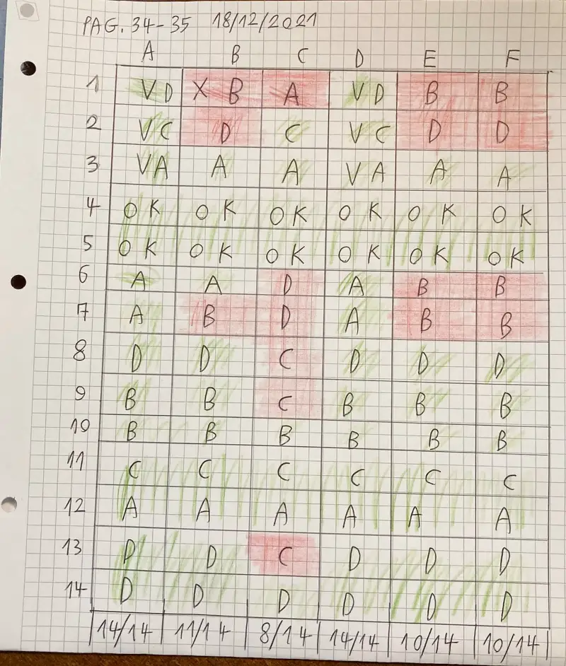

- ottimo lavoro. secondo te è interessante questo modo di visualizzare i risultati del test di matematica?
- si, perché vediamo subito quali sono stati gli esercizi più sbagliati
- esatto. su quelli lavoreremo. e quale è l’altra novità?
- che non ci sono i nomi
- perché non ci interessa chi ha sbagliato. non stiamo dando i voti e non giudichiamo nessuno. quando correggeremo insieme e rifaremo insieme gli esercizi ognuno dichiarerà i propri errori. secondo te perché C ha sbagliato tanto?
- distrazione?
- anche tu spesso ammetti di aver letto male il testo del problema o con l’ansia della fretta non aver ragionato bene, vero?
- si. 
- lo dirà C che errori ha fatto. 
- quale è l’interesse di questo test?
- che ognuno sappia se una cosa la sa o no
- e quindi secondo te avrebbe senso tirare a caso sperando nel 25% di probabilità di azzeccarla?
- no
- infatti, sebbene sia una prassi comune. Non è facile un’onesta autovalutazione, ma dobbiamo imparare ad accettarci per poter decidere se migliorarci o no. 

ora allego anche le pagine del test così se altri amici e amiche volessero farlo è tutto qui (è per la terza media ma penso che chiunque dovrebbe avere _almeno_ questo livello minimo di dimestichezza con i numeri)

