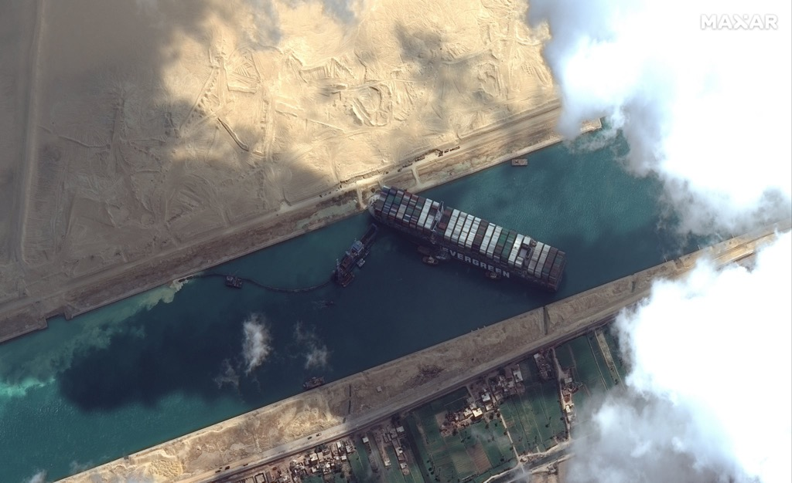

una foto satellitare della **EverGiven**, la nave container incagliata nel Canale di **Suez** (sembra per il troppo vento e tempesta di sabbia), e un'attuale mappa di tutte le navi container in circolazione.  
È fallito mezz'ora fa un tentativo di sbloccarla e si aspettano due nuovi rimorchiatori che arriveranno dopodomani.  
Così ci ricordiamo la **complessità** (e la globalità) del Sistema in cui viviamo. E soprattutto che non è mai buona cosa avere dei punti di rottura unici, ovvero che se fallisce un elemento, non ci sia una veloce alternativa più o meno automatica (sembra che circumnavigare l'Africa necessiti una settimana)
Per la cronaca, il Canale di Suez fu completato nel 1869 ed è lungo 164 Km. Nel 2015 35 km sono stati affiancati da un canale parallelo. ma 130 sono ancora a via singola.