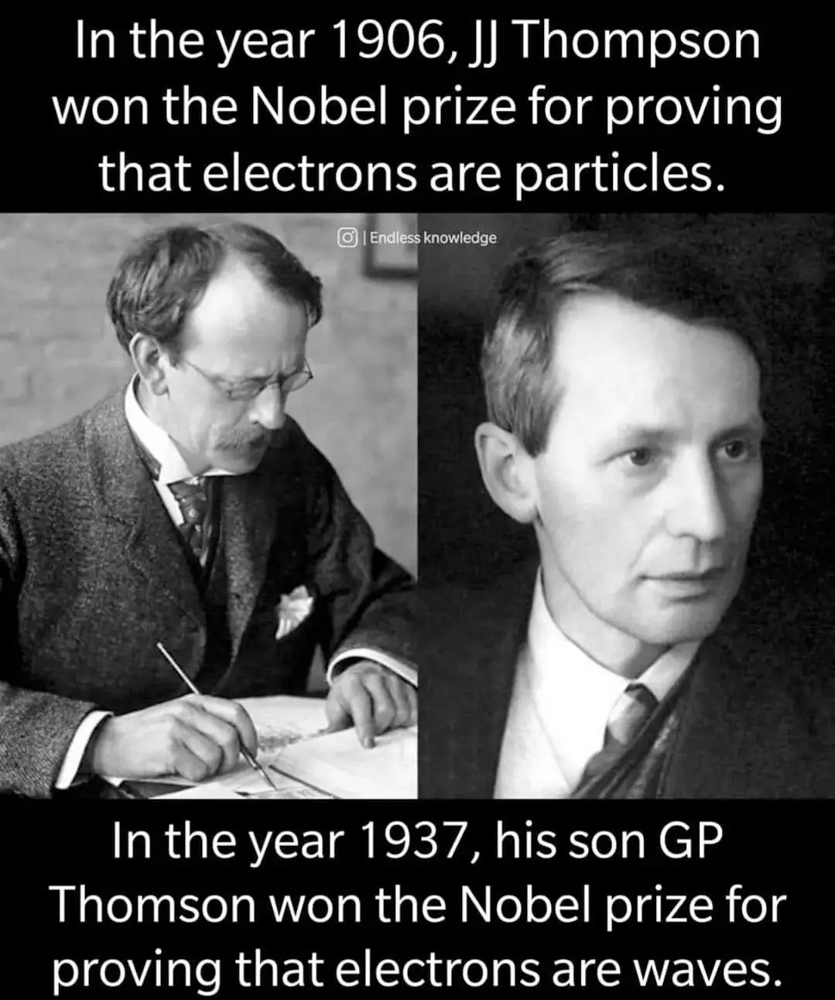

questa vale la pena essere condivisa e ricordata: padre e figlio che e a distanza di 30 anni vincono due Nobel per la fisica per aver uno scoperto e l’altro evoluto una scoperta scientifica.  
non so le loro vicende familiari ma sarebbe divertente
 poterli ascoltare: PARTICELLARE!!! NOOO ONDULATORIA!!  
e il bello è che la scienza non permette troppe “interpretazioni”, ad un certo punto dopo qualche tempo (anni o decenni se non secoli) di ricerca si arriva sempre ad un avanzamento condiviso.   
guai a fermarsi allo stato delle cose o credere che siano il punto di arrivo finale.   
c‘è però da ricordarsi che in un determinato momento storico non si può andare oltre, per ragioni tecnologiche o economiche o socioculturali.   
con gli occhi di poi tutti nel passato abbiamo sbagliato qualcosa, ma quello era il massimo che potevamo fare ed era la “verità del momento”
grazie #scienza. grazie famiglia Thompson
