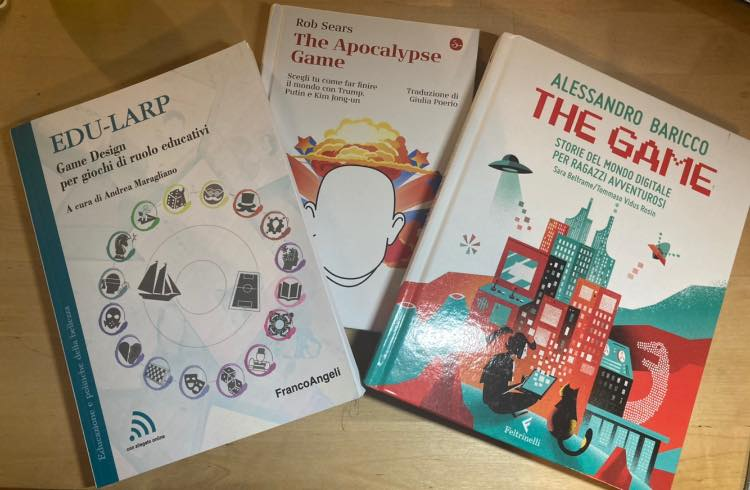

gli studi della settimana:

1. il libro essenziale per gli EduLarp. dopo aver seguito il seminario di EPALE non vedo l’ora
2. Apocalypse: un libro game dove decidi il destino sel mondo
3. la versione per ragazzi di The Game di Baricco. l’ho preso per Fabio che l’ha già afferrato ed è scappato. 
   
ricordo che [qui puoi curiosare](../../../stefano/libreria.md) la mia libreria!
