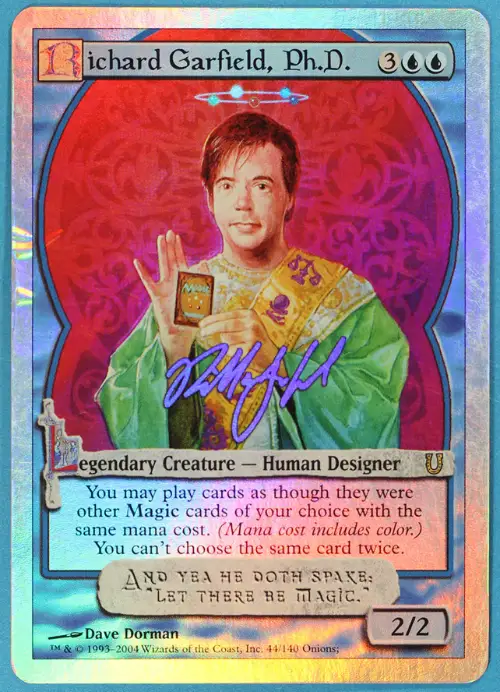

Riporto questo interessante contributo pubblicato su [senzaslot.it](https://www.senzaslot.it/manifesto-garfield/)

_**Richard Garfield**, l’autore del celeberrimo gioco di carte collezionabili **Magic the Gathering**, ha scritto il testo che, col suo consenso, ripubblichiamo qui tradotto in italiano. Riteniamo che meriti di essere letto perché affronta il tema dei giochi_ non _d’azzardo che utilizzano tecniche simili all’azzardo per sfruttare i giocatori inducendo in loro una vera e propria dipendenza. Abbiamo già parlato di questo tema di confine in_ [Vivere senza slot](http://www.senzaslot.it/vivere-senza-slot/) _nelle pagine in cui intervistiamo Ivan Venturi di Svilupparty, e lo ha ripreso Mauro Vanetti elaborando il concetto di “monetizzazione sleale” (cfr. [questo video](https://www.youtube.com/watch?v=AeooXCrIaWY) e cap. 13 di [questo libro](https://books.google.it/books?id=FKDdCgAAQBAJ&lpg=PP1&hl=it&pg=PT10#v=onepage&q&f=false)). Che una riflessione dettagliata su questo argomento venga ora da un autore di giochi così importante, tra l’altro famoso per un gioco i cui appassionati spendono cifre rilevanti, ci sembra molto significativo. Non siamo necessariamente d’accordo con tutte le conclusioni cui giunge Garfield, ma è indubbiamente una lettura stimolante che speriamo apra un dibattito ancora più ampio sul rapporto tra gioco, azzardo e dipendenza._

# Manifesto del Giocatore

Richard Garfield trasformato in una carta del suo gioco.

È mia convinzione che negli ultimi anni, nella loro ricerca di modelli di business di successo per l’intrattenimento elettronico, i game designer e le case editrici si siano imbattuti in alcune formule che funzionano solo perché abusano di segmenti della loro popolazione di giocatori. I giochi possono avere delle meccaniche che causano dipendenza e questi giochi tossici vengono creati (intenzionalmente o meno) per sfruttare i giocatori che sono vulnerabili a tali meccaniche.

Una delle ragioni per cui ciò è potuto accadere è che il prodotto finale costa molto poco, o è gratis, per la maggior parte dei giocatori, siccome la maggior parte della spesa è affrontata dai giocatori che sono diventati dipendenti.

Mi riferirò a questi giochi come _skinnerware_ \[in riferimento all’esperimento con le cavie chiamato “scatola di Skinner”, NdT\]. Gli skinnerware coincidono in larga parte con i giochi _freemium_ \[ossia quella categoria di giochi che possono essere giocati gratis ma danno un’esperienza più completa ai giocatori paganti, NdT\], ma non tutti i freemium sono skinnerware, ed esistono skinnerware che non sono freemium.

La caratteristica unica degli skinnerware è che gli acquisti al loro interno sono progettati per far scattare una risposta patologica nei giocatori vulnerabili alle dipendenze e tali acquisti non hanno limiti intrinseci: i giocatori possono pagare una quantità illimitata di denaro per raggiungere gli obiettivi a cui aspirano. Non tutte le persone sono vulnerabili agli skinnerware, anche se tutti sono più suscettibili durante i momenti più difficili della loro vita. Questa descrizione è calzante anche per le slot machine, ma finora al di fuori del gioco d’azzardo era abbastanza raro che ci fossero aziende capaci di attingere direttamente al conto in banca di un “tossico”.

Ci sono due elementi chiave del sistema di pagamento che mi fanno sospettare un gioco sia uno skinnerware:

1.  Il pagamento è sbilanciato verso una fetta molto piccola dei giocatori. Ciò è spesso difficile da determinare perché non è sempre possibile scoprire il modo in cui un gioco incassa.
2.  Il pagamento è potenzialmente illimitato: essenzialmente, non c’è limite alla quantità di denaro che si può spendere nel gioco.

Non è un problema ipotetico. È ben noto nel settore che la maggior parte degli introiti derivanti da giochi freemium di successo è generata da “balene”: pochi giocatori che spendono quantità smodate di denaro. Non farò nomi: ho parlato con impiegati che hanno fatto ricerche su alcune di queste balene per le loro aziende. Chi erano i giocatori che spendevano decine di migliaia di dollari perché non riuscivano ad aspettare che la barra dell’energia si ricaricasse o perché avevano bisogno di più _power up_? Erano persone che non potevano permettersi di spendere quelle cifre, spesso persone con uno stipendio fisso. Da quel che ho capito (ed è una nota positiva) quest’azienda si rendeva conto che era una cosa sbagliata e cercava dei modi per limitare questi comportamenti. Mettere delle pezze è uno sforzo scoraggiante, però, perché senza quei giocatori i giochi sarebbero stati considerati un fallimento e spostare il peso dell’incasso su giocatori non dipendenti è difficile, poiché, rispetto a quelli con una dipendenza, possono più facilmente abbandonare il gioco e passare ad un altro.

Alcune persone con cui ho parlato di questa faccenda si sono chieste quanti giocatori non riescano a permettersi i giochi dai quali sono dipendenti, come se questo potesse essere un buon metro della gravità della situazione. La questione non riguarda solo quei giocatori che non possono permettersi le spese che affrontano: quella è solo la categoria dov’è più facile vedere che c’è un problema. Chi è dipendente dal gioco d’azzardo non sviluppa il problema solo quando va in rovina. Gli skinnerware generalmente si possono giocare gratis se si ha pazienza o se si è disposti a passare a un altro gioco quasi uguale. Credo che praticamente ogni balena sia vittima di abuso indipendentemente dal fatto che possa permettersi o meno quanto paga.

Posso immaginare due ragioni per cui noi, come giocatori, dovremmo essere preoccupati da questo fenomeno:

**È sbagliato**. Immaginiamo un mondo dove i bar non fanno pagare i primi due drink della giornata, ma poi sparano prezzi folli per i seguenti. Ciò vorrebbe dire sfruttare un disturbo, l’alcolismo, per offrire bevute gratis a chi non è dipendente. Distribuire i costi più equamente non cura l’alcolismo, ma probabilmente lo riduce, visto che meno persone si mettono nella condizione di poter essere sfruttate; inoltre, se ne sono afflitte, non sono immediatamente ridotte alla rovina economica.

**Porterà a giochi peggiori.** I giochi, in definitiva, sono progettati in funzione delle persone che pagano per essi. Le decisioni nella progettazione che consentono a un gioco di raggiungere più giocatori patologici, oppure che sfruttano di più quelli che già ha, saranno considerate con favore anche se rendono l’esperienza di gioco un po’ peggiore. E quando approcci del genere hanno successo, incoraggiano più scelte di questo tipo. Ciò porterà ad un mondo dove tutti i giochi saranno come slot machines – scatole di Skinner progettate per massimizzare i comportamenti di dipendenza? Probabilmente no, non così all’estremo – anche se penso i giochi si stiano evolvendo in quella direzione. I giochi fanno troppo affidamento sull’esistenza di una rete sociale tra i giocatori per allontanare tutti i giocatori non dipendenti. Per i giocatori non patologici che rimarranno il design dei giochi non sarà certo ottimale: possiamo aspettarci che sia “appena decente”.

Se stai giocando a un gioco quasi gratis (o gratis) e scopri che alcuni spendono migliaia, decine di migliaia o, in certi casi, centinaia di migliaia di dollari… magari c’è un problema. Quando parlo con le persone nel settore che accettano questa pratica sento spesso considerazioni sul genere di «le persone pagano il prezzo in base al valore che attribuiscono alla cosa». Più penso a questa definizione tautologica di “valore”, meno ne sono soddisfatto. Vi invito a fare una cosa piuttosto impopolare: provate a giudicare il prezzo di qualcosa senza basarvi su questa tautologia. Se ad esempio sentiste che qualcuno ha speso diecimila dollari per un Match-3, uno di quei giochi in cui bisogna accostare tre elementi dello stesso colore per farli sparire, davvero significa che per loro vale così tanto o c’è sotto qualcos’altro? Personalmente, credo che si tratti quasi sempre di un’azienda che ha creato una dipendenza e poi è riuscita a mettersi costantemente tra l’utente patologico e l’oggetto dalla sua dipendenza.

Ci tengo a sottolineare:

**Pagare per un gioco è OK:** fare un gioco costa, e se vale la pena giocarlo è giusto che la comunità dei giocatori retribuisca gli sviluppatori.

**Giocare senza pagare è OK:** ci sono sempre stati giocatori che giocano gratis. Questa, ad esempio, è una parte fondamentale dell’industria dei giochi da tavolo, in cui di solito basta che uno dei tuoi amici abbia un gioco perché ci si possa giocare tutti. Alcuni dei giocatori non paganti poi inevitabilmente finiscono per fare pubblicità al gioco, comprarlo loro stessi, o semplicemente diventare parte di una comunità che beneficia anche quelli paganti.

**Una ditta può e dovrebbe far pagare quanto vuole per i suoi prodotti:** se un’azienda vuole far pagare il proprio gioco mille dollari faccia pure – semplicemente, il gioco non dovrebbe essere progettato con l’intento di approfittarsi di persone che soffrono di problemi di dipendenza o che si trovano in un momento della loro vita in cui sono più vulnerabili.

## Tetto di pagamento

Una possibile soluzione per chi sostiene che i propri giochi non si basino solo sul dare l’opportunità di spendere cifre illimitate a giocatori con una personalità incline alla dipendenza o desidera mettere fine a questo fenomeno è quella di porre un limite alla spesa che un singolo giocatore può sostenere, dopo la quale il giocatore “sblocca tutto”. Potrebbe trattarsi di un limite complessivo o mensile e potrebbe essere impostato dalla compagnia a piacere, a patto che sia visibile al giocatore.

Con un simile limite, noi giocatori potremmo renderci conto più facilmente di cosa ci troviamo davanti. Capiremmo che un gioco Match-3 con un limite di 30$ è probabilmente meno insidioso di uno con un limite di 3000$ mensili.

Se una compagnia influente come Apple forzasse l’uso di un limite di pagamento ben visibile, questo potrebbe limitare significativamente lo sfruttamento della dipendenza.

## Riconoscere i giochi skinnerware in base al metodo di pagamento

Ci sono molte cose per le quali di questi tempi i giocatori potrebbero trovarsi a pagare all’interno di un gioco. È spesso abbastanza facile decidere, in base alla loro natura, quali possano a lungo andare dare luogo a una meccanica di dipendenza.

**Bonus nei giochi a singolo giocatore:** non esiste alcuna ragione per vendere miglioramenti in un gioco che si gioca da soli se non il fatto che si tratta di un metodo perfetto per sfruttare la propensione a sviluppare dipendenza. Chi gioca riceve una scarica di adrenalina al completamento di un livello e via via che i livelli si fanno più difficili per riprovare quella sensazione si trova a dover scegliere tra spendere soldi e aspettare, spesso molto a lungo. Per un giocatore che non sia in stato di dipendenza comprare bonus non ha nessun senso, in generale andrebbe contro la ragione stessa per cui gioca, che sia avere una sfida o semplicemente rilassarsi.

**Barra di energia**: quando un gioco ti dice che non puoi giocare per un po’ di tempo dovreste immediatamente diventare sospettosi. Dire che non puoi giocare finché non paghi (magari guardando una pubblicità) ha senso. Dover semplicemente aspettare, invece, è un’infrazione del tradizionale patto tra il creatore di un gioco e quelli tra i suoi clienti che giocano gratis: anche loro stanno contribuendo al successo del gioco, semplicemente non lo fanno spendendo soldi ma in altri modi. Nessuno ha nulla da guadagnarci quando un giocatore viene costretto ad aspettare un po’ prima di continuare a giocare. È un meccanismo che esiste per il solo scopo di instaurare un ciclo di dipendenza nei giocatori più vulnerabili. Alcuni sviluppatori sostengono che le loro “barre di energia” sono state inserite perché il gioco è pensato per essere giocato solo a brevi sprazzi. Se così fosse, perché consentono ai giocatori di pagare per estendere il proprio tempo di gioco? Le persone che pagano non dovrebbero essere quelle che più di tutte godono dell’esperienza di gioco come è stata intesa dal suo inventore?

**Accelerare il tempo:** molti giochi suggeriscono al giocatore di pagare per far avvenire qualcosa più in fretta, come ad esempio completare la costruzione di un edificio. Questa meccanica è simile a quella della barra di energia: è progettata per rimandare il momento della gratificazione per il giocatore che, se ha una personalità incline alla dipendenza ed è stato correttamente avviato su questa strada, finirà per pagare più e più volte solo per poter provare di nuovo quel momento di euforia.

**Oggetti cosmetici:** gli oggetti cosmetici sono oggetti che non fanno parte delle meccaniche di gioco. In un certo senso questi oggetti cadono al di fuori dei criteri che uso di solito per identificare gli abusi. Penso che sia possibile avere un gioco che ha una sua “moda” senza un fine preciso e che non costituisce un abuso. Di solito faccio riferimento alla mia impressione di quale sia il valore effettivo di un elemento del gioco per stimare il livello di abuso, ma per gli oggetti cosmetici le cose sono diverse. Alcuni giocatori daranno più importanza che altri a questi oggetti, mentre più o meno tutti i giocatori condividono almeno l’idea generale di quanto valga un bonus. Per questa ragione è possibile che un gioco abbia un sistema di oggetti cosmetici abbastanza costosi che ha un elevato valore per una certa percentuale dei suoi giocatori e nessun valore per gli altri senza che questo costituisca necessariamente un abuso. Ovviamente, il modo stesso in cui gli oggetti cosmetici vengono distribuiti può essere un gioco a parte che sfrutta la dipendenza. Una slot machine a cui il giocatore accede a pagamento che distribuisce oggetti cosmetici a caso ha più probabilità di costituire un abuso che dei semplici premi ricevuti durante il gioco o un negozio apposito.

**Vantaggi nei giochi multiplayer:** pagare per qualcosa che ti dà un vantaggio sull’avversario in un gioco competitivo è qualcosa che credo si possa fare in un modo che non costituisce abuso, ma bisogna essere prudenti. Nel peggiore dei casi è una cosa che ha chiaramente il potenziale di istituire un ciclo di abuso per il giocatore vittima di dipendenza. Se un giocatore prova una sensazione positiva quando “diventa più forte” e può pagare per quell’esperienza, senza nessun limite massimo raggiungibile, possono facilmente cadere in un ciclo di dipendenza.

Tra l’altro, sono i giochi multiplayer dove si può pagare per avere un vantaggio competitivo quelli in cui ci sono giocatori che arrivano a pagare più di centomila dollari, per cui classificherei questo come il modello più pericoloso per i giocatori vulnerabili.

_Bonus_: è difficile immaginare che un gioco competitivo che vende bonus ad uso singolo non sfrutti i suoi giocatori con problemi di dipendenza;

_Esperienza e livelli_: molti giochi consentono ai giocatori di far salire di livello i propri personaggi o oggetti. Tecnicamente credo che questo si potrebbe fare in un modo che non costituisca sfruttamento, se non è possibile farlo salire all’infinito o se i costi non aumentano per ogni livello successivo, rendendo di fatto la somma totale tendente all’infinito. Per esempio, se i giocatori non paganti avessero uno svantaggio del 10% contro quelli paganti e questi ultimi potessero pagare solo una volta per salire di livello, quello sarebbe un costo limitato e probabilmente ben distribuito tra la comunità. In pratica, i pagamenti per salire di livello in un gioco multiplayer sembrano essere quasi sempre di fatto illimitati e organizzati in modo da sfruttare i giocatori in stato di dipendenza.

_Accesso a oggetti/armi_: il caso in cui si paghi per carte o personaggi per certi versi è l’opposto di quello in cui si paga per salire di livello, nel senso che in teoria può sfruttare i giocatori ma nel concreto molto spesso ha un limite pratico che viene raggiunto una volta che un giocatore sblocca tutte le carte o i personaggi di cui sente di aver bisogno per poter competere. Se uno volesse creare un gioco che sfrutta le dipendenze basandosi su questo metodo potrebbe ad esempio fornire una serie di carte praticamente infinite e sempre crescenti in potenza: tuttavia, giochi come _Hearthstone_ o _League of Legends_ hanno un numero limitato di carte o personaggi che sono tenuti più o meno bilanciati tra loro. A quel che vedo in questi giochi i giocatori competitivi spendono centinaia di dollari con regolarità; ciò può essere costoso per alcuni ma non è senza limiti, e i giocatori sembrano esserne adeguatamente consapevoli. Pagare più di così non avrebbe alcuno scopo all’interno del gioco: puoi solo diventare più potente di un tot, e una volta raggiunto quel tetto ti ritrovi sullo stesso piano di tutti gli altri.

In generale, se i giocatori possono sempre pagare per darsi un vantaggio sugli altri giocatori c’è un circolo vizioso di abuso all’opera. Se c’è un tetto di spesa, al di sopra del quale un altro giocatore non può sorpassarti ulteriormente semplicemente pagando, si tratta più che altro di un gioco che può essere comprato “a pezzi” e in cui si ha accesso all’esperienza di livello massimo solo una volta pagato il costo completo.

## Manifesto

Credo sia giunto il momento di mandare un messaggio ai designer e agli editori di giochi. Come giocatore, non giocherò né farò pubblicità a giochi che finanziano la possibilità di giocare gratis o a poco prezzo con lo sfruttamento di giocatori in condizione di dipendenza. Come game designer, non collaborerò più con editori che cercano di trasformare le mie idee in giochi skinnerware.

Se altri si unissero a me cosa potremmo concludere? Purtroppo, non è chiaro. Dal momento che la maggior parte di noi non sono il bersaglio di questi skinnerware, apportiamo ben pochi soldi, o addirittura nulla, alle compagnie che li producono, e boicottare un servizio che non paghi non serve a molto. Quello in cui potremmo fare una differenza è il livello di accettazione sociale di questi giochi. Più amici se li consigliano distrattamente l’un l’altro, più genitori consentono ai propri figli di essere riprogrammati da questi strumenti di manipolazione, più facile sarà per gli editori trovare le loro “balene”. La nostra condanna potrebbe anche dare forza alla voce di chi, all’interno dell’industria, vorrebbe vedere le cose andare diversamente.

In conclusione, non credo che lo skinnerware, come modello di business, possa essere eliminato, ma credo che possa essere quantomeno arginato. Di questa malattia, anche se non ne siamo le vittime, possiamo rifiutarci di essere portatori.

_Traduzione italiana a cura di **dottornomade**, **Francesco Rugerfred Sedda**, **Simone Sturniolo** e **[Mauro Vanetti](http://maurovanetti.info/)**._  
_Si ringrazia l’autore per aver autorizzato la pubblicazione._  
[Versione originale](https://www.facebook.com/notes/969097270250061/)
