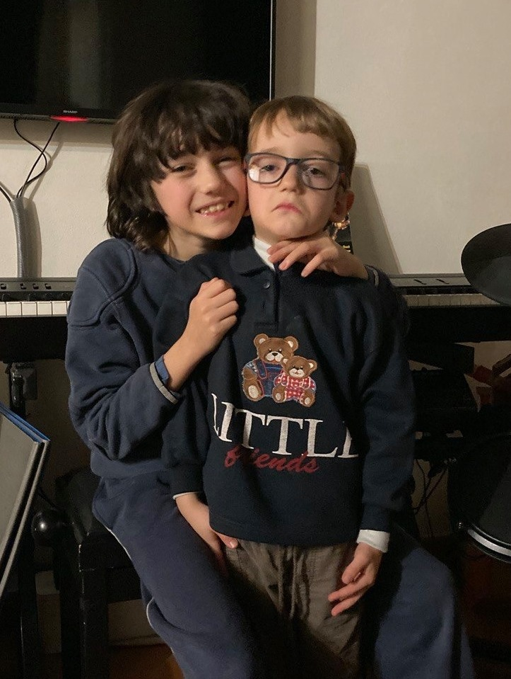

questa la pubblico a futura memoria perché è la foto più brutta che ho di Bruno ma anche una delle più belle.
mi fa troppo ridere e pensare: come semplicemente tenere la bocca e gli occhi all'ingiù trasforma tutto. 
e pensare se rimanesse così per tutta vita, di punto vestito, in contrapposizione alla solarità casual del fratello.
oppure potrebbero essere due facce della stessa cosa (come Allegria e Tristezza, le due protagoniste di InsideOut)
sappiamo che spesso è la postura a invitare o rinforzare i sentimenti, spesso basta cambiare posizione e lo spirito segue
