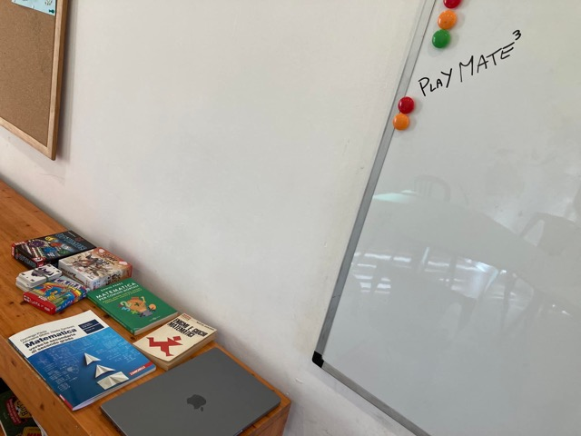

oggi abbiamo iniziato un’attività extrascolastica di “potenziamento matematico”
purtroppo ci sono un po’ di problemi di cambio professori di matematica a scuola di figlio 13 in terza media. e non tutti hanno l’intraprendenza di prendersi i libri di testo e avanzare con programmi matematici in autonomia. 
e allora perché non trasferire le chiacchiere e i giochi matematici che facciamo sempre a casa in un luogo più grande (alla Casa del Popolo di Settignano) e invitare tutta la classe? qualcuno sarà interessato. 
e così è stato: in 7 hanno partecipato, scaldandosi con una partita a 6 Nimmt e poi passare ad alcuni enigmi matematici, all’introduzione all’algebra, alla differenza tra cifra e numero, ai monomi e alle forme geometriche e matematiche con cui si propagava la nostra voce in quella stanza. 
è stata una bella e divertente esperienza per tutti. e quindi via di SABATI MATEMATICI

#todo_gallery album="2021_sabato_matematico"