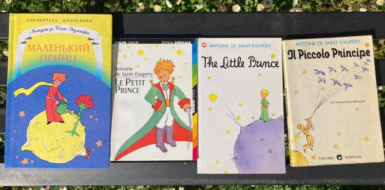

Ovvero se conosci molto bene un libro, o un film, rileggerlo in altre lingue, sopratutto la sua lingua originale, è un ottimo modo per godersi il libro e imparare le lingue.   
Ricordo da ragazzino imparai l’inglese rileggendo The Lord of the Rings (lo so molto nerd), ma il Piccolo Principe è più semplice, corto e anche amichevole.  
Lo suggerirò a mio figlio... ma credo dovrà essere un videogioco o un anime 🙂
