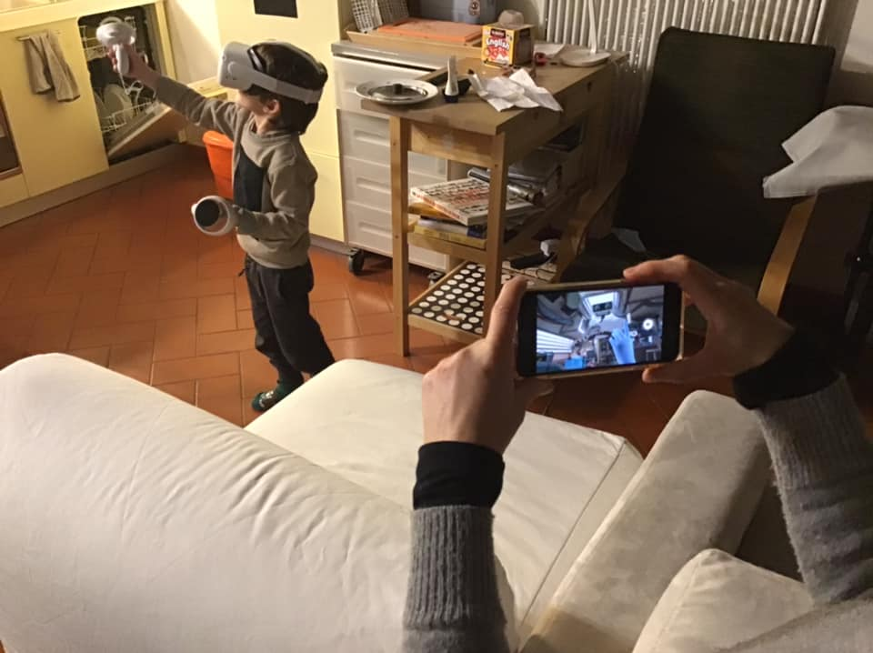

La nuova frontiera: mentre Bruno gioca con il robot virtuale e costruisce cose, la mamma lo controlla e lo aiuta nelle manipolazioni difficili (duplicando il visore su un qualsiasi cellulare)
Il punto é che ha preso da solo e si é montato la VR, entrando nella stanza giochi: “sono nella mia altra casa”. L’ha provata per la prima volta pomeriggio dopo aver visto il fratello ed é già a suo agio..
Sto indagando fino a che punto la cosa può essere problematica per questa giovane età.. ma finché le app sono adatte (niente paura o violenza o vertigini) sembra non ci siano controindicazioni.
Ricordiamo che in alcuni reparti pediatrici la VR é usata per aiutare i bambini ospedalizzati.
Vi terremo aggiornati!