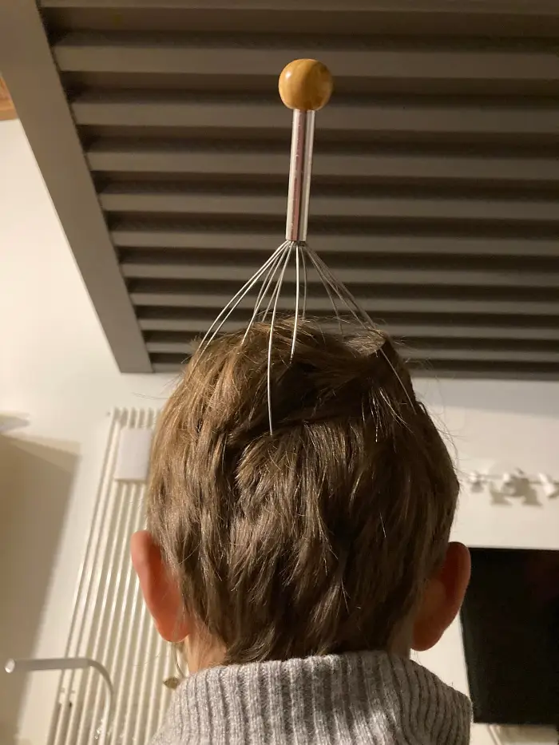

non so se c’è un nome allo studio e ricerca del “grattino rilassante”. che non è nel mondo dei massaggi (troppo impegnativi) deve essere qualcosa di estemporaneo che ti catapulta in pochi secondi in un altro mondo. 
Il “grattinator” (per i ragazzi, Orgasmotron per i post adolescenti) è sicuramente uno strumento fondamentale della Grattinologia  contemporanea, tanto che è diventato una droga condivisa e cooperativa serale. 
Funziona un poco anche da soli, ma ovviamente è il non controllo delle stimolazioni che le amplifica e rende più profonde. 
Cosa succede di preciso nel nostro corpo e cervello è ancora in fase di studio. Ma se possiamo dare un suggerimento: entrate nel Club! iniziate i vostri figli e che si divertano anche loro con la grattinologia.
Avere un modo sano,  economico e veloce per entrare velocemente in altri stati di coscienza è davvero salutare. 

PS: questo è uno dei validi motivi sul perché vale la pena fare figli 😉

Buon Anno!