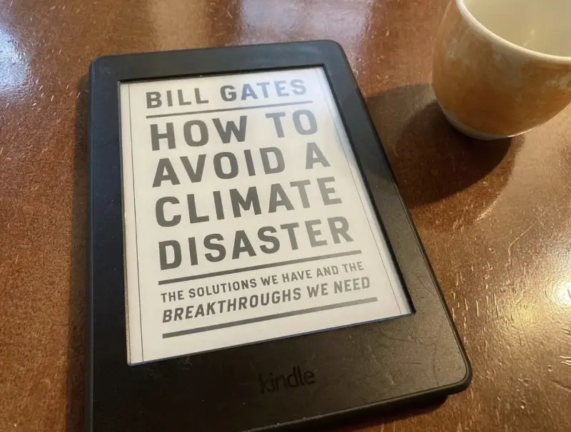

Non è tanto perché è ricco e famoso, quanto perché è molto intelligente e legge centinaia di libri l'anno, oltre ad avere un rapporto diretto con i massimi esperti del settore (di _ogni_ settore).

Quindi se scrive lui un punto sulla situazione delle possibili soluzioni praticabili in tempo utile senza scappare su Marte, io lo studio.
