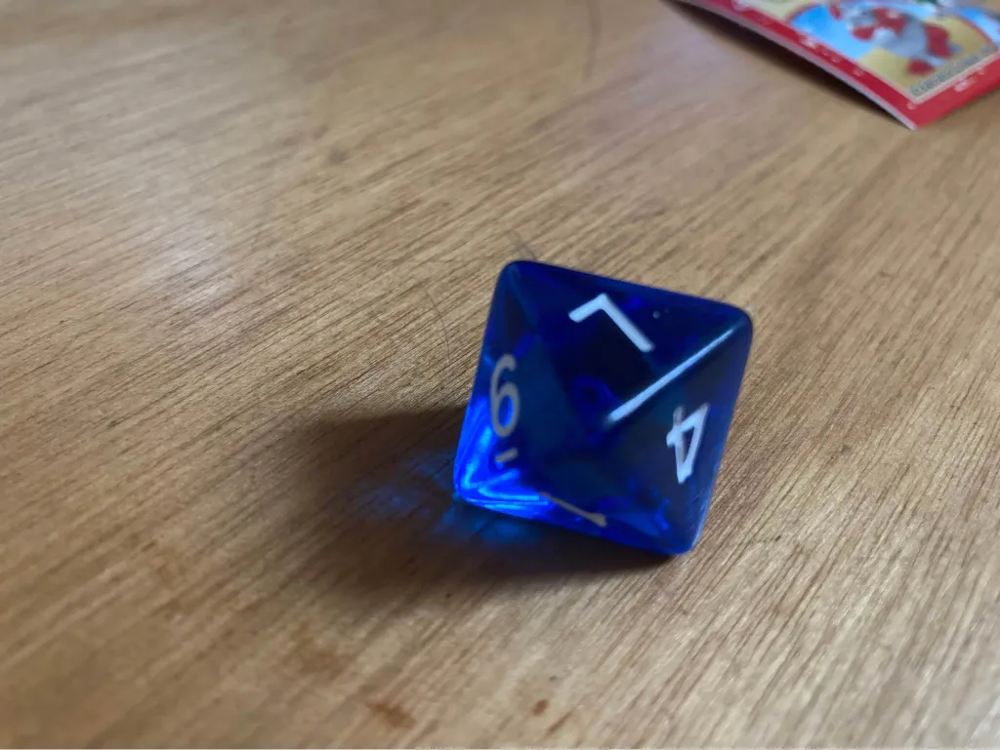

- mi è caduto il dado... è uscito 7
- ahah, bella questa. è uscito 6 vero?
- no, 7.
- dai lo sai che non è possibile... i dadi hanno sei facce e quindi i numeri vanno da 1 a 6
- ma invece c'era scritto 7
- ma li conosco bene i dadi, amorino. cmq ok, facciamo finta che sia uscito 7...
- ecco il dado
- azz. scusa. scusami tanto. avevi ragione. e si che lo so che esistono i dadi anche a 8 facce (vedi lì c'è anche l'8 ). ma me ne ero dimenticato e pensavo che mi avessi fatto uno scherzo o che..
- li so leggere i numeri.. fino a 2000!
- ti ringrazio perché oggi ho imparato una bella lezione. e penso che dovrò condividerla con i tanti amici nel mondo, perché non sai quanti problemi nascono da situazioni del genere
- dai 7?
- si. dai 7. dai pregiudizi, dalle aspettative, dal senso di superiorità, dall'ignoranza, dal non fidarsi, dalla distrazione, dal caso.
