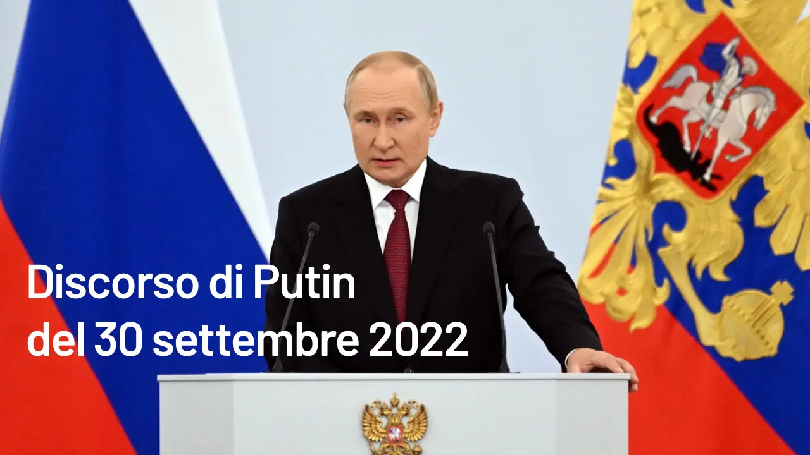

(premessa: lo condivido solo per interesse di conoscenza. Non per parte presa)
Ho cercato una versione integrale con traduzione affidabile del discorso di Putin del 30 settembre. Perché? Perché sembra che sia un discorso che potrebbe cambiare la vita di tutti noi se davvero fosse il punto di rottura e l'avvio di guerra di campo tra gli Stati Uniti (e Occidente progressista) da un lato e Russia (e mondo Conservatore) dall'altro.

Prima di sedersi al tavolo della trattativa di Pace, cosa che mi auguro succeda il prima possibile, è bene leggere con attenzione quanto abbiano detto i russi. 
Questa è la traduzione dell'Ambasciata russa in Italia.

⬜️🟦🟥 Discorso del Presidente Putin in occasione della firma degli accordi per l'ammissione alla Russia delle Repubbliche popolari di Donetsk e Lugansk, delle regioni di Zaporozhye e al Kherson.

Cari cittadini della Russia, cittadini delle Repubbliche popolari di Donetsk e Lugansk, abitanti delle regioni di Zaporozhye e Kherson, deputati della Duma di Stato e senatori della Federazione Russa!
Come sapete nelle repubbliche popolari di Donetsk e Lugansk, nelle regioni di Zaporozhye e Kherson si sono svolti i referendum. Lo spoglio è terminato e i risultati sono noti. La gente ha fatto la sua scelta, una scelta inequivocabile.

Oggi firmiamo i trattati di ammissione alla Russia della Repubblica Popolare di Donetsk, della Repubblica Popolare di Lugansk, della Regione di Zaporozhye e della Regione di Kherson. Sono sicuro che l'Assemblea Federale sosterrà le leggi costituzionali sull'ammissione e la formazione in Russia di quattro nuove regioni, quattro nuove entità costitutive (nuovi soggetti) della Federazione Russa, perché questa è la volontà di milioni di persone.

E questo, ovviamente, è un loro diritto, un diritto inalienabile, sancito dal primo articolo della Carta delle Nazioni Unite che afferma esplicitamente il principio dell'uguaglianza dei diritti e dell'autodeterminazione dei popoli.

Ripeto: questo è un diritto inalienabile del popolo, si fonda sull'unità storica, in nome della quale hanno vinto generazioni di nostri antenati, coloro che dalle origini dell'antica Russia nel corso dei secoli hanno costruito e difeso la Russia. Qui, in Novorossia, hanno combattuto Rumyantsev, Suvorov e Ushakov, Caterina II e Potemkin hanno fondato nuove città. Qui i nostri nonni e bisnonni hanno dato la vita durante la Grande Guerra Patriottica.

Ricorderemo sempre gli eroi della "primavera russa", coloro che non hanno accettato il colpo di Stato neonazista in Ucraina nel 2014, tutti coloro che sono morti per il diritto di parlare la propria lingua madre, preservare la propria cultura, le proprie tradizioni e la propria fede, per il diritto di vivere. I combattenti del Donbass, i martiri della "Katyn di Odessa ", le vittime dei disumani attacchi terroristici del regime di Kiev. Volontari e milizie, civili, bambini, donne, anziani, russi, ucraini, persone di diverse nazionalità. Alexander Zakharchenko, un vero leader popolare di Donetsk, i comandanti Arsen Pavlov e Vladimir Zhoga, Olga Kochura e Alexey Mozgovoy e Sergey Gorenkoprocuratore della Repubblica di Lugansk. Il paracadutista Nurmagomed Khadzhimagomedov e tutti i nostri soldati e ufficiali che sono caduti da valorosi durante l'operazione militare speciale. Sono eroi. (Eroi della grande Russia. E vi chiedo di osservare un minuto di silenzio in loro memoria.

(Minuto di silenzio).

Grazie.

Dietro la scelta di milioni di persone nelle Repubbliche popolari di Donetsk e Lugansk, nelle regioni di Zaporozhye e Kherson c'è il nostro destino comune e una storia millenaria. Le persone hanno trasmesso questo legame spirituale ai loro figli e nipoti. Nonostante tutte le prove che hanno dovuto affrontare, hanno serbato negli anni il loro amore per la Russia. E nessuno può distruggere in noi questo sentimento. Per questo sia le generazioni più anziane che quelle più giovani, nate dopo la tragedia del crollo dell'Unione Sovietica, hanno votato per la nostra unità, per il nostro futuro comune.

Nel 1991, nella Foresta di Belovezha, incuranti della volontà della gente comune, le allora élite di partito decisero di sciogliere l'URSS e la popolazione si trovò da un giorno all'altro staccata dalla propria patria. Tutto questo ha lacerato e diviso la nostra unità nazionale e si è trasformato in una catastrofe nazionale. Proprio come una volta, dopo la rivoluzione, i confini delle Repubbliche dell'Unione sono stati tracciati sommariamente, e dunque gli ultimi leader dell'Unione Sovietica hanno fatto a pezzi il nostro grande Paese, nonostante la volontà espressa dalla maggioranza nel referendum del 1991, hanno semplicemente messo i popoli davanti al fatto compiuto.

Posso concedere che non si rendessero nemmeno pienamente conto di ciò che stavano facendo e delle conseguenze che alla fine ci sarebbero state. Ma ormai non ha più importanza. L'Unione Sovietica non c'è più, il passato non ritorna. E la Russia di oggi non ne ha bisogno, non è questa la nostra aspirazione. Ma non c'è nulla di più forte della determinazione di milioni di persone che per cultura, fede, tradizioni e lingua si considerano parte della Russia e i cui antenati per secoli hanno vissuto in un unico Stato. Non c'è nulla di più forte della determinazione di queste persone a tornare nella loro vera patria storica.

Per otto lunghi anni, la popolazione del Donbass è stata sottoposta a genocidio, bombardamenti e assedi, mentre a Kherson e Zaporozhye si è criminosamente cercato di inculcare l'odio verso la Russia, verso tutto ciò che è russo. Ora, ancora durante i referendum, il regime di Kiev minacciava di rappresaglia gli insegnanti e le donne che lavoravano nelle commissioni elettorali, intimidiva, con la minaccia di repressioni, milioni di persone che volevano esprimere la propria volontà. Ma le popolazioni integerrime di Donbass, Zaporozhye e Kherson hanno detto la loro.

Voglio che le autorità di Kiev e i loro veri padroni in Occidente mi ascoltino e voglio che tutti ricordino quanto dico: le persone che vivono a Lugansk e Donetsk, Kherson e Zaporozhye diventano nostri cittadini per sempre.

Chiediamo al regime di Kiev di cessare immediatamente il fuoco, tutte le ostilità, la guerra che ha scatenato nel 2014 e di tornare al tavolo dei negoziati. Siamo pronti per questo, è stato detto molte volte. Ma la scelta del popolo di Donetsk, Lugansk, Zaporozhye e Kherson non sarà messa in discussione, è stata fatta e la Russia non la tradirà. E le odierne autorità di Kiev devono trattare questa libera espressione della volontà popolare con rispetto e in nessun altro modo. Questa è l'unica via per la pace.

Difenderemo la nostra terra con tutte le nostre forze e i nostri mezzi e faremo tutto il possibile per garantire la sicurezza del nostro popolo. Questa è la grande missione di liberazione del nostro popolo.

Sicuramente ricostruiremo le città e i paesi distrutti, le case, le scuole, gli ospedali, i teatri e i musei, ripristineremo e svilupperemo le industrie, le fabbriche, le infrastrutture, la previdenza sociale, l’assistenza pensionistica, il sistema sanitario e quello scolastico.

Naturalmente, lavoreremo per migliorare il livello di sicurezza. Insieme faremo in modo che i cittadini delle nuove regioni sentano il sostegno di tutto il popolo russo, di tutto il Paese, di tutte le repubbliche, di tutte le province e le regioni della nostra grande Madrepatria.

Cari amici, colleghi!
Oggi vorrei rivolgermi ai soldati e agli ufficiali coinvolti nell'operazione militare speciale, ai soldati del Donbass e della Novorossia, a coloro che dopo il decreto sulla mobilitazione parziale si uniscono alle Forze armate, adempiendo al loro dovere patriottico, e che si recano agli uffici di registrazione e arruolamento militare di persona, ascoltando il richiamo del loro cuore. Vorrei anche rivolgermi ai loro genitori, alle loro mogli e ai loro figli e dire loro per cosa sta combattendo il nostro popolo, contro quale nemico ci stiamo battendo, chi sta precipitando il mondo in nuove guerre e crisi, traendo da questa tragedia il proprio cruento profitto.

I nostri compatrioti, i nostri fratelli e sorelle in Ucraina - parte costitutiva della nostra nazione unita - hanno visto con i loro occhi ciò che i circoli governativi del cosiddetto Occidente stanno preparando per tutta l'umanità. Qui, infatti, hanno semplicemente gettato la maschera e mostrato il loro vero volto.

Dopo il crollo dell'Unione Sovietica, l'Occidente ha deciso che il mondo, tutti noi, avremmo dovuto sopportare per sempre i suoi diktat. All'epoca, nel 1991, l'Occidente contava sul fatto che la Russia non si sarebbe ripresa da quegli sconvolgimenti e si sarebbe semplicemente disintegrata. Ci è mancato poco: noi ricordiamo gli anni '90, i terribili anni '90, affamati, freddi e senza speranza. Ma la Russia è sopravvissuta, è rinata, si è rafforzata e ha occupato di nuovo il posto che le spetta nel mondo.

Al contempo, l'Occidente ha cercato e continua a cercare una nuova occasione per colpirci, per indebolire e distruggere la Russia, cosa che ha sempre sognato di fare, per frammentare il nostro Stato, per mettere i nostri popoli gli uni contro gli altri, per condannarli alla povertà e all'estinzione. Non riescono proprio ad accettare il fatto che al mondo esiste un Paese così grande, enorme, con il suo territorio, le sue ricchezze naturali, le sue risorsee un popolo che non può e non potrà mai vivere ubbidendo a ordini dall’esterno.

L'Occidente è disposto a fare qualsiasi cosa pur di preservare il sistema neocoloniale che gli permette di sfruttare, in sostanza derubare, il mondo grazie alla potenza del dollaro e del diktat tecnologico, riscuotere dall'umanità un vero e proprio tributo, estrarre la principale fonte di un benessere non guadagnato, la rendita egemonica. La conservazione di questa rendita costituisce la loro vera, assolutamente egoistica motivazione chiave. Ecco perché è nel loro interesse la totale desovranizzazione. Da qui l'aggressione agli Stati indipendenti, ai valori e alle culture tradizionali, da qui i tentativi di minare i processi internazionali e di integrazione che sfuggono al loro controllo, le nuove monete mondiali e i centri di sviluppo tecnologico. Per loro è fondamentale che tutti i Paesi cedano la propria sovranità a favore degli Stati Uniti.

Le élite al potere di alcuni Stati accettano volontariamente di farlo, accettano volontariamente di diventare vassalli; altri vengono corrotti, intimiditi. E se l’operazione fallisce, distruggono interi Stati, lasciandosi dietro catastrofi umanitarie, disastri, rovine, milioni di sorti umane rovinate e stritolate, enclave terroristiche, aree di disastro sociale, protettorati, colonie e semicolonie. A loro non importa, purché possano ottenere i loro benefici.

Voglio sottolineare ancora una volta: è l'avidità, l'intento di mantenere il proprio potere illimitato, la vera ragione della guerra ibrida che l'"Occidente collettivo" sta conducendo contro la Russia. Non vogliono che siamo liberi, vogliono vederci come una colonia. Non vogliono una cooperazione paritaria, ma una rapina. Non vogliono vederci società libera, ma folla di schiavi senz'anima.

Il nostro pensiero e la nostra filosofia sono una minaccia diretta per loro, ecco perché attaccano i nostri filosofi. La nostra cultura e la nostra arte sono una minaccia per loro, quindi cercano di vietarle. Il nostro sviluppo e la nostra prosperità sono una minaccia anche per loro: la concorrenza cresce. Non hanno affatto bisogno della Russia, la Russia serve a noi.

Vorrei ricordarvi che in passato le pretese di dominio del mondo si sono infrante più di una volta sul coraggio e la resistenza del nostro popolo. La Russia sarà sempre la Russia. Difenderemo ancora i nostri valori e la nostra Madrepatria.

L'Occidente conta sull'impunità, sul fatto che la farà franca su tutto. Di fatto, l'ha fatta franca fino ad oggi. Gli accordi di sicurezza strategica finiscono nel cestino; gli accordi raggiunti al più alto livello politico vengono dichiarati una farsa; le ferme promesse di non espandere la NATO verso est, con le quali sono stati comprati i nostri ex dirigenti, si sono rivelate una sporca messinscena; i trattati sulla difesa missilistica e sui missili a medio raggio vengono denunciati unilateralmente con pretesti inverosimili.

Da tutte le parti si sente dire che l'Occidente difende un ordine basato sulle regole. Da dove vengono? Chi ha visto queste regole? Chi le ha negoziate? Sentite, si tratta di un'assurdità, di un puro inganno, non due, ma tre pesi e tre misure! Fatto apposta per gli sciocchi, semplicemente.

La Russia è una grande potenza millenaria, un Paese di civiltà, e non ha intenzione di vivere secondo queste regole truccate e fasulle.

È stato proprio il cosiddetto Occidente a calpestare il principio dell'inviolabilità dei confini e ora decide a propria discrezione chi ha diritto all'autodeterminazione e chi no, chi non ne è degno. Non è chiaro perché lo decidano, né chi abbia dato loro questo diritto. Se lo sono presi.

Ecco perché suscita in loro una rabbia cieca la scelta dei cittadini di Crimea, Sebastopoli, Donetsk, Lugansk, Zaporozhye e Kherson. Questo Occidente non ha il diritto morale di valutare tale scelta e nemmeno di parlare di libertà di democrazia. Non lo hanno e mai lo hanno avuto!
Le élite occidentali negano non solo la sovranità nazionale e il diritto internazionale. La loro egemonia è di natura decisamente totalitaria, dispotica e di apartheid. Dividono impudentemente il mondo in vassalli, in Paesi cosiddetti civilizzati e in tutti gli altri che, secondo i disegni degli odierni razzisti occidentali, dovrebbero entrare nella lista dei barbari e dei selvaggi. Le false etichette - "Paese canaglia", "regime autoritario" - sono già pronte, stanno marchiando interi popoli e Stati, e non è una novità. Non c'è nulla di nuovo: le élite occidentali sono rimaste colonialiste come erano. Discriminano, dividono i popoli in classi.

Non abbiamo mai accettato e non accetteremo mai questo nazionalismo politico e questo razzismo. E cos'è, se non razzismo, la russofobia che si sta diffondendo in tutto il mondo? Che cos'è, se non razzismo, l'indiscussa convinzione dell'Occidente che la sua civiltà, la sua cultura neoliberale, sia il modello indiscutibile per il resto del mondo? "Chi non è con noi è contro di noi". Suona persino strano.

Le élite occidentali stanno addirittura scaricando la colpa dei propri crimini storici su tutti gli altri, pretendendo che sia i propri cittadini sia gli altri popoli si dichiarino colpevoli di qualcosa con cui non hanno avuto nulla a che fare - ad esempio, il periodo delle conquiste coloniali.

Vale la pena ricordare all'Occidente che ha iniziato la sua politica coloniale già nel Medioevo, poi ci sono stati la tratta mondiale degli schiavi, il genocidio delle tribù indiane in America, il saccheggio dell'India e dell'Africa, le guerre dell'Inghilterra e della Francia contro la Cina, costretta ad aprire i propri porti al commercio dell'oppio. Cos’hanno fatto: reso interi popoli dipendenti dalle droghe, sterminato deliberatamente interi gruppi etnici per la terra e le risorse e dato vita a una vera e propria caccia all’uomo trattato bestia. Questo è contrario alla natura umana, alla verità, alla libertà e alla giustizia.

E noi, noi siamo orgogliosi che nel XX secolo sia stato il nostro Paese a guidare il movimento anticoloniale, che ha aperto a molti popoli del mondo la possibilità di svilupparsi, di ridurre la povertà e le disuguaglianze e di sconfiggere la fame e le malattie.

Vorrei sottolineare che una delle ragioni della secolare russofobia e della rabbia non celata di queste élite occidentali nei confronti della Russia è proprio il fatto che non ci siamo fatti derubare durante la conquista coloniale e abbiamo costretto gli europei a commerciare con reciproco vantaggio. Ciò è stato possibile grazie alla creazione in Russia di un forte Stato centralizzato, che si è sviluppato ed è stato rafforzato dai grandi valori morali dell'Ortodossia, dell'Islam, dell'Ebraismo e del Buddismo, nonché dalla cultura e dalla lingua russa, accessibili a tutti.

È noto che sono stati fatti ripetuti piani di intervento in Russia, hanno cercato di utilizzare l’epoca dei Torbidi all'inizio del XVII secolo e il periodo di sconvolgimenti dopo il 1917, ma hanno fallito. L'Occidente è riuscito a mettere le mani sulle ricchezze della Russia solo alla fine del XX secolo, quando lo Stato è stato distrutto. Ci hanno chiamato amici e partner, ma in realtà ci hanno trattato come una colonia: trilioni di dollari sono stati sottratti al Paese con schemi diversi. Tutti noi ricordiamo tutto, non abbiamo dimenticato nulla.

In questi giorni, i cittadini di Donetsk e Lugansk, di Kherson e Zaporozhye si sono espressi per ripristinare la nostra storica unità. Grazie!
Da secoli i Paesi occidentali affermano di portare libertà e democrazia alle altre nazioni. È esattamente il contrario: invece di democrazia, repressione e sfruttamento; invece di libertà, schiavitù e violenza. L'intero ordine mondiale unipolare è intrinsecamente antidemocratico e non libero, è falso e ipocrita fino in fondo.

Gli Stati Uniti sono l'unico Paese al mondo ad aver usato due volte le armi nucleari, distruggendo le città giapponesi di Hiroshima e Nagasaki. Tra l'altro, hanno creato un precedente.

Vorrei anche ricordarvi che gli Stati Uniti, insieme agli inglesi, senza alcuna necessità militare durante la Seconda guerra mondiale hanno ridotto in rovina Dresda, Amburgo, Colonia e molte altre città tedesche. E questo è stato fatto in modo dimostrativo, senza, ripeto, necessità militare. L'obiettivo era uno solo: come nel caso dei bombardamenti nucleari in Giappone, intimidire il nostro Paese e il mondo intero.

Gli Stati Uniti, con i loro barbari bombardamenti a tappeto, il napalm e le armi chimiche, hanno lasciato un segno terribile nella memoria dei popoli della Corea e del Vietnam.

Di fatto stanno ancora occupando la Germania, il Giappone, la Repubblica di Corea e altri Paesi, mentre cinicamente li definiscono alleati alla pari. Mi chiedo che tipo di alleanza sia questa. Tutto il mondo sa che i dirigenti di questi Paesi sono spiati e che i loro leader sono intercettati non solo nei loro uffici, ma anche nelle loro case. È un vera vergogna. Vergogna per chi lo fa e per chi, come schiavo, ingoia in silenzio e con rassegnazione questa protervia.

Chiamano solidarietà euro-atlantica gli ordini e le urla sgarbate e offensive indirizzate ai loro vassalli; chiamano nobile ricerca medica lo sviluppo di armi biologiche e gli esperimenti su esseri umani vivi, anche in Ucraina.

Con le loro politiche distruttive, le loro guerre, i loro saccheggi hanno provocato l'enorme ondata di flussi migratori di oggi. Milioni di persone subiscono privazioni, abusi, muoiono a migliaia nel tentativo di raggiungere l'Europa.

Ora esportano grano dall'Ucraina. Dove va a finire con il pretesto di "garantire la sicurezza alimentare ai paesi più poveri del mondo"? Dove va? Va tutto negli stessi Paesi europei. Solo il 5% è stato destinato ai Paesi più poveri del mondo. Ancora una volta un'altra bufala e un vero e proprio inganno.

L'élite americana sta essenzialmente usando la tragedia di queste persone per indebolire i suoi rivali, per distruggere gli Stati nazionali. Questo vale anche per l'Europa, per l'identità di Francia, Italia, Spagna e di altri Paesi con una storia secolare.

Washington chiede sempre più sanzioni contro la Russia, e la maggior parte dei politici europei umilmente concorda. Capiscono chiaramente che gli Stati Uniti, spingendo l'UE ad abbandonare totalmente l'energia e le altre risorse russe, stanno praticamente deindustrializzando l'Europa e si stanno impadronendo completamente del mercato europeo - capiscono tutto, queste élite europee, capiscono tutto, ma preferiscono servire gli interessi degli altri. Non si tratta più di una banalità, ma di un diretto tradimento dei loro popoli. Ma che Dio li accompagni, sono affari loro.

Ma le sanzioni non bastano agli anglosassoni che sono ricorsi al sabotaggio - incredibile, ma è un dato di fatto: facendo saltare i gasdotti internazionali del North Stream, che passano sotto il Mar Baltico, distruggendo di fatto l'infrastruttura energetica europea. È evidente a tutti chi ne trae vantaggio. Ovviamente, lo ha fatto chi ne ha beneficiato.

Il dettato statunitense si basa sulla forza bruta, sulla legge del pugno forte. A volte è ben confezionato, altre volte non lo è, ma l'essenza è la stessa: il potere del pugno forte. Da qui il dispiegamento e il mantenimento di centinaia di basi militari in ogni angolo del mondo, l'espansione della NATO e i tentativi di formare nuove alleanze militari come l'AUKUS e simili. Si sta inoltre perseguendo attivamente un legame politico-militare tra Washington, Seul e Tokyo. Tutti gli Stati che possiedono o aspirano a possedere un'autentica sovranità strategica e sono in grado di sfidare l'egemonia occidentale sono automaticamente arruolati come nemici.

È su questi principi che si fondano le dottrine militari degli Stati Uniti e della NATO, che non chiedono altro che il dominio totale. Le élite occidentali presentano i loro piani neocoloniali nello stesso modo ipocrita, con la pretesa anche di essere pacifisti, parlando di una sorta di contenimento; questa parola così subdola sta migrando da una strategia all'altra, ma, in realtà, significa una cosasola: minare qualsiasi centro sovrano di sviluppo.

Abbiamo già sentito parlare del contenimento di Russia, Cina e Iran. Credo che altri Paesi in Asia, America Latina, Africa e Medio Oriente, così come gli attuali partner e alleati degli Stati Uniti, siano i prossimi. Sappiamo che quando qualcosa non è di loro gradimento, impongono sanzioni anche contro gli alleati: una contro una banca, una contro un'altra; una contro un'azienda, una contro un'altra. È una pratica che verrà estesa. Tengono tutti nel mirino, compresi i nostri vicini più prossimi: i Paesi della CSI.

Al contempo, è evidente che l'Occidente confonde palesemente il desiderio con la realtà. Nel lanciare la guerra lampo delle sanzioni contro la Russia, ad esempio, hanno pensato di poter costruire ancora una volta il mondo intero a loro comando. Tuttavia, una prospettiva così brillante non entusiasma tutti, ma solo i veri masochisti politici e i seguaci di altre forme non convenzionali di relazioni internazionali. La maggior parte degli Stati si rifiuta di "mettersi sull’attenti " e sceglie la strada ragionevole della cooperazione con la Russia..

È chiaro che l'Occidente non si aspettava una tale sfida da parte loro. Sono semplicemente abituati ad agire secondo uno schema predefinito: prendere tutto con la forza, il ricatto, la corruzione e l'intimidazione, e si convincono che questi metodi funzioneranno per sempre, come se si fossero consolidati, congelati nel tempo.

Questa arroganza è una diretta conseguenza non solo del noto concetto della propria eccezionalità - anche se, ovviamente, è sorprendente - ma anche della vera e propria "fame di informazione" in Occidente. La verità è stata affondata in un oceano di miti, illusioni e falsi, utilizzando una propaganda oltremodo aggressiva, mentendo come Goebbels. Più incredibile è la bugia, più velocemente la gente ci crederà: è così che operano, secondo questo principio.

Ma la gente non può essere nutrita con dollari ed euro in banconote. Non si può sfamare la gente con quei pezzi di carta e non si può riscaldare la casa con la capitalizzazione virtuale e gonfiata dei social network occidentali. Tutto questo è importante, quello di cui parlo. Ma non meno importante è quello che ho appena detto: non si può sfamare nessuno con i pezzi di carta - c'è bisogno di cibo, e queste capitalizzazioni gonfiate non possono nemmeno riscaldare nessuno - c'è bisogno di risorse energetiche.

Ecco perché i politici europei devono convincere i loro concittadini a mangiare meno, a fare il bagno meno spesso e a vestirsi più pesante in casa. E coloro che iniziano a fare domande corrette: "Perché, insomma succede così?", sono subito dichiarati nemici, estremisti e radicali. Si cambiano le carte in tavola contro la Russia, dicendo: ecco, è la fonte di tutti i vostri problemi. Mentono di nuovo.

Quello che vorrei sottolineare è che ci sono tutte le ragioni per credere che le élite occidentali non cercheranno soluzioni costruttive alla crisi alimentare ed energetica globale, nata per loro colpa, esattamente per loro colpa, come risultato della loro pluriennale politica molto prima della nostra operazione militare speciale in Ucraina, nel Donbass. Non intendono risolvere i problemi di ingiustizia e disuguaglianza. Esiste il rischio che siano pronti a utilizzare altre ricette, a loro consuete.

E qui vale la pena ricordare che l'Occidente è uscito dalle contraddizioni dell'inizio del XX secolo attraverso la Prima Guerra Mondiale. Le ricompense della Seconda Guerra Mondiale hanno permesso agli Stati Uniti di superare definitivamente gli effetti della Grande Depressione e di diventare la più grande economia del mondo, imponendo al pianeta il potere del dollaro come valuta di riserva globale. L'Occidente ha ampiamente superato la crisi degli anni '80 - anche negli anni '80 del secolo scorso la crisi si è aggravata - appropriandosi dell'eredità e delle risorse dell'Unione Sovietica in dissolvimento e dissolta. Questo è un dato di fatto.

Ora, per uscire da un altro groviglio di contraddizioni, hanno bisogno a tutti i costi di spezzare la Russia, altri Stati che scelgono la via sovrana dello sviluppo, per rubare ancora di più le ricchezze altrui e così chiudere, tappare i loro buchi. Se ciò non dovesse accadere, non escludo che cercheranno di portare il sistema al collasso al quale poi potranno attribuire la colpa di tutto, oppure, Dio non voglia, decideranno di usare la nota formula "la guerra cancella ogni cosa ".

La Russia comprende la sua responsabilità nei confronti della comunità mondiale e farà di tutto per far rinsavire queste teste calde.

Ovviamente, l'attuale modello neocoloniale a conti fatti è condannato. Ma lo ripeto, i suoi veri padroni si aggrapperanno ad esso fino alla fine. Semplicemente non hanno nulla da offrire al mondo se non la conservazione dello stesso sistema di rapina e racket.

In sostanza, sputano sul diritto naturale di miliardi di persone, la maggior parte dell'umanità, sulla libertà e sulla giustizia, sulla possibilità di determinare il proprio futuro. Ora sono passati alla radicale negazione delle norme etiche, della religione e della famiglia.

Rispondiamo noi stessi ad alcune domande molto semplici. Ora voglio tornare a quello che ho detto, e voglio anche rivolgermi a tutti i cittadini russi, non solo ai colleghi in platea, ma a tutti i cittadini russi: ma davvero nel nostro Paese, in Russia, vogliamo avere "il genitore numero uno", "il numero due", "il numero tre" (sono completamente impazziti!) al posto di una mamma e un papà? Vogliamo davvero che le nostre scuole inizino a insegnare ai bambini delle elementari a creare perversioni che portano al degrado e all'estinzione? Che venga loro insegnato che oltre alle donne e agli uomini esisterebbero dei gender e che venga loro proposto un intervento per cambiare sesso? È questo che vogliamo per il nostro Paese e per i nostri figli? Tutto questo per noi è inaccettabile, abbiamo un altro futuro, nostro.

Ripeto, la dittatura delle élite occidentali è diretta contro tutte le società, compresi gli stessi popoli dei Paesi occidentali. È una sfida per tutti. Questa negazione totale dell'uomo, la sovversione della fede e dei valori tradizionali, la soppressione della libertà assumono le caratteristiche di una "religione al contrario" - un vero e proprio satanismo. Nel Discorso della Montagna, Gesù Cristo, denunciando i falsi profeti, disse: "Dai loro frutti li riconoscerete". E questi frutti velenosi sono già evidenti per la gente, non solo nel nostro Paese, ma in tutti i Paesi, comprese molte persone nello stesso Occidente.

Il mondo è entrato in un periodo di trasformazioni rivoluzionarie che hanno un carattere fondamentale. Si stanno formando nuovi centri di sviluppo, che rappresentano la maggioranza - la maggioranza! – della comunità globale e sono pronti non solo ad affermare i propri interessi, ma anche a difenderli, e vedono nel multipolarismo un'opportunità per rafforzare la propria sovranità e quindi per ottenere una vera libertà, una prospettiva storica, il diritto a uno sviluppo indipendente, creativo e originale, a un processo armonioso.

In tutto il mondo, compresi Europa e Stati Uniti, come ho detto, abbiamo molte persone che la pensano come noi e sentiamo, vediamo il loro sostegno. In diversi Paesi e società si sta sviluppando un movimento di liberazione e anticoloniale contro l'egemonia unipolare. La sua soggettività non potrà che aumentare. È questa la forza che determinerà la futura realtà geopolitica.

Cari amici!
Oggi lottiamo per un percorso giusto e libero, prima di tutto per noi stessi, per la Russia, perché la dittatura, il dispotismo restino per sempre nel passato. Sono convinto, i Paesi e i popoli capiscono che una politica costruita sull'eccezionalità di qualcuno, chiunque esso sia, sulla liquidazione di altre culture e popoli, è intrinsecamente criminale, eche dobbiamo voltare questa pagina vergognosa. Il crollo dell'egemonia occidentale, che è iniziato, è irreversibile. Lo ripeto ancora una volta: non sarà più come prima.

Il campo di battaglia a cui il destino e la storia ci hanno chiamato è il campo di battaglia per il nostro popolo, per la grande, storica Russia. Per una grande Russia storica, per le generazioni future, per i nostri figli, nipoti e pronipoti. Dobbiamo proteggerli dalla schiavitù, dai mostruosi esperimenti che cercano di storpiare le loro menti e le loro anime.

Oggi lottiamo perché nessuno pensi mai che la Russia, il nostro popolo, la nostra lingua, la nostra cultura, possano essere presi e cancellati dalla storia. Oggi abbiamo bisogno di un consolidamento di tutta la società e solo la sovranità, la libertà, la creatività e la giustizia possono costituire la base di questa unità. I nostri valori sono umanità, misericordia e compassione.

E vorrei concludere con le parole di un vero patriota: Ivan Aleksandrovich Ilyin: "Se considero la mia patria la Russia, significa che amo, medito e penso in russo, che canto e parlo in russo; che credo nei poteri spirituali del popolo russo. Il suo spirito è il mio spirito; il suo destino è il mio destino; la sua sofferenza è il mio dolore; la sua prosperità è la mia gioia”.

Dietro queste parole c'è una grande scelta spirituale che molte generazioni di nostri antenati hanno seguito per i più di mille anni di esistenza dello Stato russo. Oggi questa scelta viene fatta da noi, dai cittadini delle Repubbliche popolari di Donetsk e Lugansk e dagli abitanti delle regioni di Zaporozhyee Kherson. Hanno scelto di stare con il propriopopolo, di stare con la Madrepatria, di vivere il suo destino e di vincere insieme a lei.

La verità è dalla nostra parte, la Russia è dalla nostra parte!
Mosca, Cremlino - 30 settembre 2022