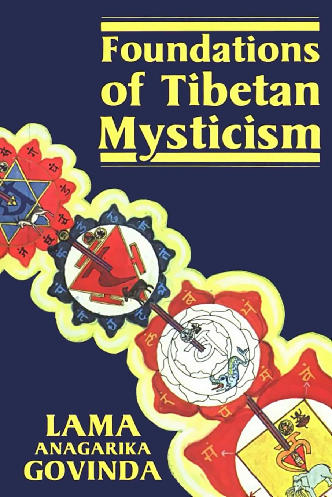
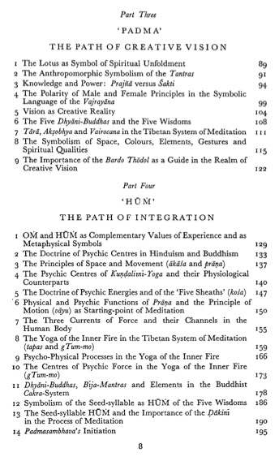
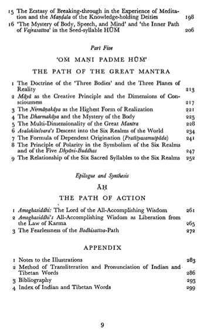
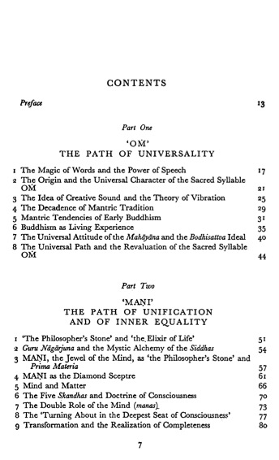

per chi ama le cose belle ma non troppo facili.  
  
a volte le maggiori scoperte avvengono solo dopo lunghi e complessi percorsi di ricerca.  
per scoprire magari che la soluzione era stata lì, semplice e palese davanti agli occhi di tutti, ma non la vedevi perché non la riconoscevi.  
  
in ogni caso sarà lo spirito dell'esploratore o il gusto di empatizzare con altri tempi e altri luoghi, a volte ci si inoltra in sentieri che portano in vallate poco battute quanto meravigliose.  
  
ci sono molti libri che parlano del misticismo tibetano, ma questo è particolare, va nei dettagli di molti temi che potrebbero interessare. allego l'indice per i curiosi.  
  
l'abito non fa il monaco e il monaco non porta abiti  
  
#tibet #misticismo #libribelli