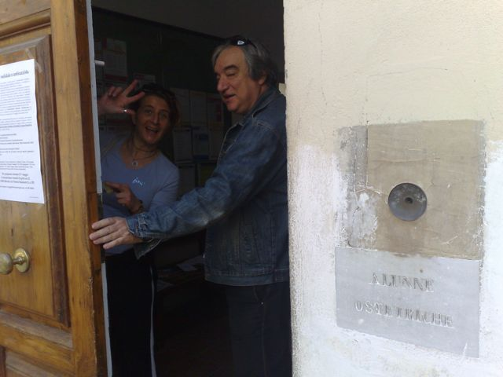
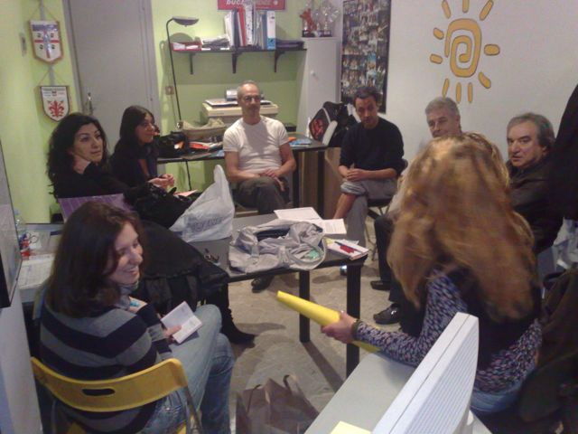
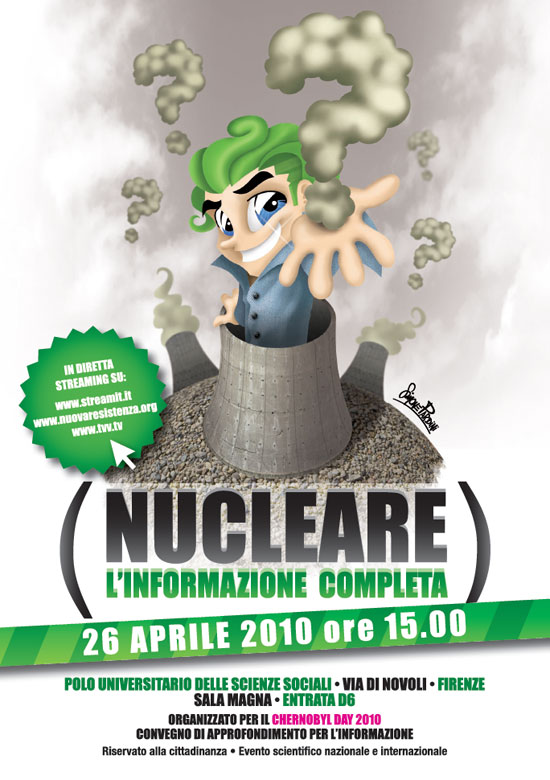

finalmente.. dopo un anno praticamente dedicato al progetto della Marcia Mondiale.. e un'inverno dedito allo studio e un po' di riposo… si torna in piena attività!

con **Mondo Senza Guerre** Firenze stiamo promuovendo la conferenza di lunedì prossimo sul nucleare civile e militare.

intanto oggi continuato il volantinaggio per la città e le università…

e in serata la riunione settimanale del nostro gruppetto.. ancora pochi ma buoni! speriamo di essere sempre di più!

ecco i volantini della conferenza di **lunedì prossimo**.. per rimanere in contatto scrivimi oppure <http://www.mondosenzaguerre.org/firenze/>

Mondo Senza Guerre Firenze invita a questo incontro di informazione e approfondimento sul nucleare civile e militare.

Relatori:
- Giuseppe Onufrio - direttore esecutivo Greenpeace Italia
- Bruno Chareyron - ingegnere nucleare - Francia
- Claudio Pagliara - medico oncologo 
- Angelo Baracca - fisico
- Gianni Mattioli - fisico
- Mariella Gavarini- WWF Toscana (moderatrice)

saranno presenti anche epidemiologi e studiosi del caso nucleare

