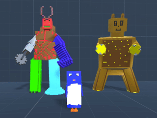

Siamo tornati a casa dopo la seconda IF/JAMURR Kids Game Jam all’[Internet Festival](http://www.internetfestival.it/eventi/kids-game-jam/) a Pisa ed ecco una sintesi di quello che è successo e di quello che succederà ora:

appena arrivati sabato mattina, i ragazzi hanno allestito lo spazio (presso [MixArt](http://www.mix-art.org/))



avremmo lavorato in una dozzina di persone e l’ambiente è importante.

Quando sono arrivati tutti (6 bambini a cui si sarebbe aggiunto il settimo nel pomeriggio) e 5 grandi, abbiamo fatto la presentazione del tema, che era “PUNTI DI VISTA” (puoi vederne qui le slides)





abbiamo dibattuto a lungo su alcune immagini.. tipo questa papera/coniglio.. e le guerre che si fanno in nome dell’interpretazione (parziale o personale) delle cose.



finita la cuscinata, ci siamo messi al lavoro in brainstorming, definendo il concept generale del gioco:



ogni bambino avrebbe sviluppato un proprio personaggio, con particolarità, storia e punto di vista. li avrebbero messi in un “ambiente” proprio, e poi tutti in un unico mondo, dove è arrivato uno strano essere, la ZIZZAGNA, che ha portato scompiglio a tutti, alterando i punti di vista soliti e acuendo lo scontro tra i vari personaggi.

il giocatore avrebbe esplorato questo mondo (in prima persona 3D, per farlo semplice) parlando con tutti cercando di capire la loro situazione. una volta aiutati i singoli personaggi, questi sarebbero “venuti con noi”, o meglio: il giocatore avrebbe potuto incarnarne il punto di vista, in alcuni momenti del gioco (ad esempio se diventavi amico della formica, in seguito potevi diventare una formica piccola, per poter passare in micro passaggi)

non entriamo nei dettagli del game design che lo giocherete.

ogni ragazzo ha compilato una “scheda del personaggio” cartacea e siamo quindi passati alla produzione dei personaggi, in Voxel (grazie al MagicaVoxel che ormai tutti adoriamo)

> NOTA: parte fondamentale della nostra Jam è l’approcciare un tema personale/sociale e svilupparlo, con discussioni, immagini ed esempi, usando lo strumento del videogioco come risultato finale.

al lavoro!


c’è chi ha lavorato anche solo in pixel art, per trasformare in seguito il suo personaggio in 3D con l’aiuto del papà.



mentre i ragazzi proseguivano con la costruzione dei personaggi e dei loro ambienti, i “grandi” assistevano e preparavano il “contenitore” del gioco, questo perché la programmazione e lo sviluppo (in Unity) lo lasciamo ai più grandi o in altri momenti, **qui ci interessava lavorare sopratutto di contenuti e design, non programmazione e sviluppo informatico**.



a fine giornata i 7 personaggi base, e delle loro “props” (accessori) erano finiti e anche la bozza generale del gioco



alle 19 siamo andati a vedere cosa stavano facendo alla Jam dei “grandi” e poi tutti in pizzeria!

e non ci siamo lasciati scappare una passeggiata merenda per Pisa che è davvero bella!



ma prima di andare a dormire una partita a biliardo!



Domenica mattina si sono finiti gli ambienti e fatte le animazioni.. intanto ognuno scriveva per bene tutti i testi/dialoghi di ogni personaggio..

ah: ovviamente non mancheranno labirinti e oggetti segreti da scoprire ovunque!









le animazioni sono state davvero una della parti più divertenti, con risultati eccellenti:

dopo pranzo una fase importante: **le registrazioni delle voci**.. per fortuna avevamo un bello studio attrezzato dove c’era un po’ di silenzio 🙂 ognuno ha dato il meglio di sè, superando tensioni e timidezze. (avevamo pronti i testi anche in inglese ma li registreremo più avanti)



per le 16:00 tutte le parti del nostro gioco erano pronte.. ahh ovviamente ci serviva il titolo del gioco e suo logo.. e Angelo ha fatto una bella proposta che è piaciuta a tutti:



dato che alla fine i ragazzi partecipanti sono sempre stati 7 (come l’anno scorso!) ma siamo passati dal 2D al 3D in modalità Voxel: **7 FRAMES^3 – THE CUBED ADVENTURE**




sul finire il buon Ruben ha anche improvvisato **il tema musicale del gioco**, bellissimo

stanchi morti ma davvero soddisfatti, siamo tornati ai nostri treni e rientrati a casa



ci mancano ancora un po’ di cose per completare il gioco (il livello del Boss, disporre bene la mappa, testare, suonare tutte le musiche) e contiamo di farvelo giocare entro Natale!

siamo organizzati in modo la lavorarci una sera alla settimana, e dovremmo farcela.




se tutto ciò che abbiamo fatto ti sta piacendo, faccelo sapere!

> NOTA: tutto il progetto è Open Source sotto licenza Creative Commons, puoi vederne il sito di sviluppo e partecipare qui: <https://github.com/jamurr/JAM.7FRAMES_Cubed/>

## A PRESTO DA TUTTI NOI:
- Angelo, Davide, Enea, Fabio, Maia, Micol, Ruben
- Stefano Cecere, Annabella Coiro, Dario Pelella, Mauro Vanetti, Pietro Polsinelli
