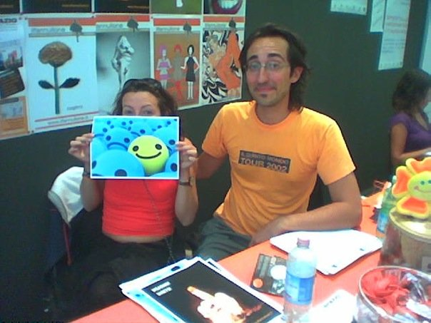

Lunedì 22 aprile si svolgeranno le primarie del Movimento 5 Stelle per selezionare i candidati per le elezioni europee del 2024.  
Chiedo a tutti gli iscritti del M5S della **circoscrizione Centro Italia (Lazio, Marche, Toscana e Umbria)** di valutare la mia auto candidatura.

## CHIEDIMI QUALSIASI COSA
Prima di leggere qui sotto, ricordo di potermi chiedere quasiasi cosa 

- per email [stefano.cecere@gmail.com](mailto:stefano.cecere@gmail.com)
- sul mio [canale Telegram](https://t.me/cecere2042)
- su [questo post di Facebook](https://www.facebook.com/cecere2042/posts/pfbid0nNKjfEvKJED8RxM41ECCbQm2NmKzezk218hZcWRkiTbxLS4cHvf8zsEeL5Gn4br3l)

### Sei immune al fascino del potere? Non è che poi ci tradisci?
Ne avevo scritto [qui](https://cecere.xyz/post/coraggio-virus-del-potere/)

### Di chi ti fidi?

- Di chi si impegna per l'insieme anche quando non c'è un ritorno personale diretto.  
- Di chi fa le foto delle attività per documentare e condividere, pur sapendo che non comparirà mai nelle foto (io, sempre, ad esempio).  
- Di chi ascolta tutti e poi fa una bella sintesi.  
- Di chi ha dimostrato nei fatti, non solo in parole o in un curriculum, di impegnarsi per la società che sogna.  
- Di chi lavora su se stesso per migliorarsi e studia tutti i giorni.

### Cosa hai fatto per il Movimento?

- Sono quello che prima delle manifestazioni crea e stampa i volantini o procura le bandiere.
- E prima ancora crea tutti i canali Telegram o mailing list a cui potersi inscrivere per iniziare a partecipare.
- O che dà consigli su come organizzarsi [vedi qui](https://2050x.org/scuola/manuale-attivista/guide/diffusione-e-crescita)

> diciamo sono quello che agevola e aiuta la partecipazione e l'auto-formazione.. per essere più efficaci nell'attivismo

### Abbiamo bisogno di pacifisti, cosa hai fatto per la pace?
Più che pacifisti (in teoria sono tutti "per la pace") c'è bisogno di **nonviolenza attiva come metodologia**. Abbiamo Costituzioni che proibiscono l'uso delle armi per la risoluzione dei conflitti e possiamo illustrare quanto "violenza genera violenza". Abbiamo ora visto (lo sapevamo già.. ma ora è ufficiale) quanto le trattative di pace Ucraina/Russia fossero sul tavolo appena iniziato il conflitto, ma fu sabotato da entità politiche esterne (USAn GB e anche Europa). Queste cose vanno denunciate senza timore di perdere la poltrona.  
Per questo motivo come 5S dobbiamo essere in tanti.. non basta un singolo.
Cosa ho fatto per la Pace? sono cresciuto politicamente con gli amici che andavano nel Kosovo durante i bombardamenti NATO.. e dal 2001 non so quante dozzine di manifestazioni, attività, giornali, concerti (ero musicista professionista) ho organizzato. Per non parlare della Marcia Mondiale per la Pace e la Nonviolenza che mi impegnò un anno (dal 2009 al 2010) tra preparazione e produzione. Sono andato anche a Roma da Fiorello mentre registrava per sensibilizzarlo sullo scudo stellare in costruzione nel 2007 in Repubblica Ceca  ([vedi](https://www.youtube.com/watch?v=ZOf2zKqOC-Y)), o banchini per il disarmo atomico quando non sapevamo ancora di avere le bombe in casa 
Praticamente si tratta di sensibilizzare, mobilitare, non votare i politici sostenuti dall'apparato industriale miliatare, banca etica, economia solidale, cultura della nonviolenza.. studio...  
e infine cercare sempre di trovare la violenza dentro di se (perché ce l'abbiamo tutti) e capire da dove arriva e cercare di risolverla.

### Reddito di base universale
> se verrai eletto, cosa (e se) hai intenzione di fare per promuovere il reddito di base universale? Come riuscire, secondo te, se lo reputi una soluzione valida, a metterlo in pratica al più presto in Italia visto le sempre maggiori diseguaglianze sociali che aumentano incontrollate e la totale carenza di possibilità di lavoro dignitoso
Come Movimento Umanista parlavamo già di UBI (Universal Basic Income) già dagli anni '90, capendo dove andava il mondo (evoluzione tecnologica e concentrazione di potere). Ma sono state l'Industria 4.0 (automazione e robotica) e la crisi mondiale del 2008 e mettere in agenda seriamente la cosa, promossa paradossalmente dai grandi capi d'azienda tecnologiche. Le A.I. contemporanee stanno dando il colpo di grazie e rendendo la faccenda davvero urgente.
**DA FARE**: innanzitutto comunicazione a tutti i livelli facendo capire la gravità della situazione e l'accelerazione degli eventi. Tessere grandi relazioni con tutti gli stakeholders europeei (politici, media, personalità, industria) sensibili. Dare massima visibilità ai tanti esperimenti dove si sta attuando. 
Ma tutto questo necessita una operazione sistemica con lo spostamento delle risorse dalla speculazione finanziaria e industriale non necessaria (vedi apparato militare - industriale), e una promozione del welfare statale e di una nuova filosofia di vita. Rendere di moda uno stili di vita sobrio senza inseguire gli impossibili e distruttivi modelli di vita delle grandi star e delle super potenze dominatrici.

### Israele / Palestina
> Tutti parlano di soluzione a due stati per il conflitto in terra santa, ma solo pochissimi stati della UE riconoscono ufficialmente lo stato Palestinese. Te voteresti una risoluzione che impone a tutti gli stati UE di riconoscere ufficialmente la Palestina?

Assolutamente si, e il M5S è in questa linea. E se avesse dubbi lavorerei perché si convinca che sia una priorità. Spagna e Irlanda si stanno muovendo. Città del Vaticano da tempo. 

> Sei favorevole a sanzioni e blocchi di invii/commerci di armi con Israele almeno fino alla fine della rappresaglia in atto in Palestina?

Assolutamente. Sebbene la questione sia complessa e storica, non cadiamo nella retorica di chi iniziò per primo, ma vediamo la realtà attuale: violenza genera violenza. Ogni bambino ucciso genera 2 nuovi terroristi. Il governo israeliano si sta muovendo fuori da ogni logica e buon senso, se non risoluzioni internazionali e ha quasi la maggioranza della popolazione israeliana contro.

### Armi in Ucraina
> Sei a favore dell'immediato blocco di invio di armi verso l'Ucraina ed alla promozione da parte dell'Ue di una vera conferenza di pace, con la presenza di entrambe le parti in guerra, per mettere fine al conflitto con un accordo?

Assolumente. Sopratutto ora che è ufficiale che USA/GB e EU boicottarono e fecero fallire i negoziati di pace che Russia e Ucraina stavano stabilendo già un mese dopo l'attacco di febbraio 2022.

### Privatizzazioni / Liberalizzazioni
> Le privatizzazioni/Liberalizzazioni che sono alla base delle politiche UE, ma si stanno rivelando sempre più un fallimento, soprattutto per il peggioramento del livello di qualità della vita dei cittadini e dei lavoratori coinvolti nei processi di privatizzazioni. Cosa faresti riguardo le ventilate ipotesi di privatizzazioni  di ulteriori quote statali di Aziende cardine del ns sistema economico  ( Poste, Enel ecc)  solo per fare cassa? E cosa proponi per invertire la rotta sulle privatizzazioni?

Chi è attivo e attento alla politica internazionale e italiana ha visto le privatizzazioni iniziare con l'ingresso nell'euro.. già dal Panfilo del 1992 (Draghi era lì a firmare) e con l'avvallo e promozione sopratutto del fu PdS / centro sinistra, si attuarono privatizzazioni di apparati statali e di servizi che dovevano rimanere pubblici. L'Italia è sempre stata la gallina dalle uova d'oro in quanto tra le detentrici del più alto risparmio privato mondiale. Oggi che non possediamo più neanche una rete telefonica ci rendiamo conto perché siamo il fanalino di coda.. facendo fatica anche solo a cablare in alta velocità il territorio.
Sono per la libera impresa e la buona concorrenza, ma il servizi di base devono rimanere in mano pubblica, senza politiche di "travaso" promosse anche da un semi-intenzionale lasciar degradare il pubblico.
Ora che le piccole entità nazionali hanno sempre meno potere, di fronte ai colossi USA, GB e BRICS, e di fronte alle nuove Tech Companies che sono più potenti di interi stati, **è oltemodo necessaria una collaborazione a livello continentale**.

## Perché mi candido?

- Ho le competenze, le capacità e l’esperienza che servono: dalla creazione di comunità alla comunicazione, dalla conoscenza tecnica dell'intelligenza artificiale a come promuovere il dialogo e la nonviolenza, dalla velocità di apprendimento al ragionamento sistemico.
- Ho passione per le relazioni e il dialogo costruttivo. So riconoscere le persone in gamba e quelle subdole.
- Sono attivista dal 1996 (avevo 23 anni) per il cambiamento sociale con priorità la partecipazione dell'insieme e l'educazione
- Sono iscritto al M5S dal 2009 e con tutte le sue evoluzioni è ancora miglior attuale progetto politico, rivoluzionario, dal grande potenziale, ma ha bisogno di persone esperte di attivismo per renderlo più dinamico e pro-attivo.
- L'ambito europeo è congeniale per la mia esperienza internazionale e per portare avanti i grandi temi critici che ormai sono globali (A.I., clima, multipolarismo)
- Perché lo scoramento degli esseri umani valenti e solidali ritarda il cammino della storia
  
## Temi chiave su cui sono molto esperto

- Intelligenza Artificiale e Innovazione Tecnologica
- Pace e Nonviolenza Attiva
- Nuovo Umanesimo
- Educazione 2050 e Life Long Learning
- Coinvolgimento e Comunità

## Cosa ho fatto ultimamente per il M5S

- creato il sito [2050x.org](https://2050x.org) con centinaia di materiali e guide per gli attivisti
- promosso e creato tutti i canali Telegram "ufficiali" per i coordinatori provinciali
- promosso e creato la newsletter del M5S: [https://m5sinforma.substack.com](https://m5sinforma.substack.com/)
- curo quotidianamente il canale Telegram di rassegna stampa e l'ecosistema: [https://linktr.ee/m5sinforma](https://linktr.ee/m5sinforma)
- creato il [server Discord](https://discord.gg/9YWqd5y9KG) per il Movimento toscano
- promosso dozzine di iniziative e flash mob per la pace
- creato materiali informativi per tutte le attività e riunioni
- collaborato all'organizzazione delle riunioni provinciali
- creato mailing list e canali per agevolare la formazione del GT
- iniziato a fare censimento e contatti ufficiali di tutte le realtà M5S toscane da dare in mano ai coordinatori provinciali (vedi [https://2050x.org/m5s/territori/](https://2050x.org/m5s/territori/))
- ho parlato a diversi livelli su come migliorare la comunicazione, l'organizzazione delle comunità e favorire la formazione di base degli attivisti

## Riferimenti
_Potete andare direttamente a questi link dove non ho nascosto nulla di quello che faccio e penso:_

- Profilo M5S: <https://portale.movimento5stelle.eu/partners/stefano-cecere-185163>
- Progetto 2050x / M5S InForma: <https://2050x.org/>
- Newsletter 2042 su tecnologia, educazione e futuro: <https://2042.substack.com/>
- Portale 2042ed: <https://2042ed.org/>
- Profilo Facebook: <https://www.facebook.com/StefanoCecere/>
- Pagina Facebook: <https://www.facebook.com/cecere2042>
- LinkedIn: <https://www.linkedin.com/in/stefanocecere/>

## Tema: Intelligenza Artificiale
Mi occupo di A.I. dal 2002 e sviluppando videogiochi l'ho approfondita, messa in pratica a insegnata negli ultimi 15 anni.

Ho tenuto incontro di formazione con la Scuola di Cittadinanza del Fatto Quotidiano e su vari canali online. 

Vi invito a leggere la mia newsletter <https://2042.substack.com/> dove ne parlo in termini divulgativi.

- È stato questo a ucciderli tutti? (indicando una testata nucleare)  
- No, è stata l'arroganza a porre fine al loro regno. La convinzione di essere il culmine della creazione li spinse ad avvelenare l'acqua, a uccidere la terra e a soffocare il cielo. Alla fine non servì l'inverno nucleare, ma solo il lungo autunno del loro egocentrismo.
- Ehm... Ti senti bene?
- Sì scusate, pensavo che suonasse meglio di: "No, si sono fottuti con le loro mani perché erano un branco di coglioni!" (_tratto da Love, Death & Robots_)

## Tema: Pace e Nonviolenza Attiva
  
  
  

Ho iniziato a studiare la nonviolenza attiva nel 1997 e già nel 2003 ero alla grande Manifestazione per la Pace a Roma.

Nel 2007 eravamo a manifestare e organizzare attività in tutta Europa contro lo scudo stellare che gli USA stavano costruendo in Repubblica Ceca... già si annusava l'aria che tirava.

Puoi leggere tutto quello che ho fatto, qui: <https://cecere.xyz/about/attivista/>

## Tema: Nuovo Umanesimo

Leggi qui: <https://cecere.xyz/about/umanista/>

## Tema: Educazione 2050

Dal 2008 la mia preoccupazione sono le nuove generazioni e il tema dell'educazione, chiavi della rigenerazione e del prepararsi alle grandi crisi che stiamo vivendo.

In questa ottica sono funzionali il progetto [2042](https://2042ed.org/) e [2050x](https://2050x.org), e la mia [newsletter](https://2042.substack.com/) che conta già più di 400 iscritti.

## Tema: Coinvolgimento e Comunità

Sono particolarmente appassionato dal costruire comunità e dal rendere partecipi le persone. Nel 2003 spiegavo agli attivisti di mezza Europa come usare internet e i primi siti web 2.0, poi ho costruito piattaforme di tutti i tipi, sempre nell'ottica di rendere le persone capaci di usare gli strumenti e attivarsi.

Oggi sono vicepresidente di una Casa del Popolo, aiuto diverse associazioni a migliorare la propria comunicazione, ho fatto di tutto per migliorare gli strumenti di comunicazione del Movimento 5 Stelle Toscano.

## Chi sono?

Valuta la mia esperienza trentennale su <https://cecere.xyz>

- Sono consulente per l'Innovazione Tecnologica applicata alla società e alla formazione
- Sviluppo videogiochi educativi e per l'impatto sociale positivo
- Sono attivista per l'Umanesimo e la Nonviolenza attiva dal 1996
- Lavoro da 30 anni con i computer e le nuove tecnologie digitali
- Laureando in Scienze della Formazione e Filosofia della Scienza
- Ambasciatore dell'OpenSource e dell'Intelligenza Collettiva
- Nato a Monza, a Firenze dal 2008, due Figli
- Musicista professionista con centinaia di concerti in tutta Europa
- Esperto di comunicazione generativa, coivolgimento e organizzazione di comunità
- Organizzo laboratori ludico/creativi (STEAM) per ragazzi
- Considero il Gioco una delle attività più potenti di esperienza e formazione
- Da quand avevo 16 anni ho lavorato da operaio, da professionista, da dipendente, da imprenditore in dozzine di realtà importanti
- Considero la Politica come un Servizio necessario per il meglio comune
- Forse meglio aggiungerlo: **parlo molto bene inglese** (e spagnolo e altri linguaggi), sono incensurato, da sempre in regola con le tasse, non uso droghe, non ho bisogno di un nuovo "lavoro" né di fama.

## Perchè mi candido?

Partiamo dalla base: **mi occupo di attivismo politico e culturale dal 1996**, non sono un improvvisato sulla via di Beppe Grillo, rimando altrove a curiosare su [cosa ho fatto in 30 anni](https://cecere.xyz/about/attivista/), e penso che **arriva il momento in cui bisogna seriamente mettersi a disposizione dell'insieme prendendosi delle responsabilità**. Perchè è troppo facile stare fuori, magari a fare cose bellissime, e vivere o criticando o aspettandosi che siano sempre gli altri a fare quello che ritieni il meglio.  

Se poi una cosa come la Politica ti appassiona e la ritieni importante è frustrante vedere come tutti i giorni venga bistrattata, corrotta, ridotta a banali sgambetti di potere da parte di persone che sembrano non avere cuore, cervello, cultura, senso di realtà, visioni, senso di servizio.

Devo aggiungere che negli ultimi 30 anni ho fatto molte altre cose, non solo attivismo politico, che a ben vedere è solo una piccola parte, una declinazione di "espressione nel mondo" di quello che uno sente dentro.

**Ho lavorato tanto e studiato ancora di più**. I miei interessi sono sempre stati molto ampi e variegati, rientrando nel mondo dei "multipotenziali" ovvero tra quelle persone che conoscono l'arte e il gusto di **imparare ad imparare** facilmente e grazie alla grande curiosità e capacità di concentrazione riescono bene in qualsiasi cosa vogliano applicarsi, che sia la musica o la matematica, l'ingegneria o l'insegnamento. Chi è un po' nerd/hacker sa di cosa parlo.

Multipotenzialità a parte, sono cresciuto in una **società che ti voleva incasellare in un punto fisso**: tu sei ingegnere e quello fai, tu farai l'operaio, tu il parrucchiere, tu il manager, tu niente. Per non parlare delle posizioni "politiche" tu sei di destra e io di sinistra, tu sei cattolico e io ateo, tu europeo io africano, tu capitalista egoista io altruista volontario etc.

La realtà è che noi non siamo dei punti fissi, statici, che nasciamo e dobbiamo morire lì dove il caso o la società ci hanno messo. Non siamo neanche degli esseri monodimensionali come i punti.
Sarebbe più bello considerarci come **esseri multidimensionali** e ci spostiamo all'interno di uno spazio, più o meno ampio, che definisce la profondità della nostra vita. 

Non solo ci possiamo muovere e cambiare nel mondo esterno, ma soprattutto possiamo e dobbiamo farlo nel nostro mondo interno, dove le dimensioni sono i nostri valori e **la dinamica del movimento è il senso della nostra vita**.

Ad esempio io posso essere un amante della musica, scoprire che mi piace più comporre musica che ascoltarla, ma avere a cuore il pianeta e ritenere più importante l'equilibrio delle relazioni rispetto allo sbilanciamento delle risorse.  
Posso amare i giochi e ritenerli lo strumento più importante per fare esperienza, vorrei che tutti i bambini del mondo (ma anche gli gli adulti) possano fare esperienze che li faccia imparare ad essere più sicuri in se stessi, ho un profondo senso di fede negli altri che mi dà l'energia per promuovere questa idea.  
Sono un operaio che ha lavorato decenni in catene sempre pià automatizzate e so cosa vuol dire fare la stessa cosa tutti i giorni per tutta la vita e vedere il surplus del mio lavoro andare ad arricchire altri. Non so bene quando le Intelligenze Artificiali mi sostituiranno ma so che lo faranno. Mi rilassa dipingere e rappresento il mio disagio in disegni che nessuno guarderà mai.  
Un programmatore di videogiochi può interessarsi alle esperienze religiose e magari facendo un viaggio in autostop per il mondo capire qualcosa di psicologia e sociologia che i "professionisti" statici nei loro studi non hanno capito, ne farà un videogioco che cercherà di riprodurre quei temi.
Un musicista che gira il mondo può andare a cena a casa di una persona conosciuta a caso durante il proprio concerto e scoprire quanto è profondo e vario il mondo e scriverlo sul suo blog.

E il bello è che uno può continuare ad esplorare le proprie dimensioni interne, esprimendosi poi nel mondo esterno come meglio potrà. E accenno solo che **quello che uno fa nel mondo esterno andrà a ripercuotersi nel mondo interno, in una interazione continua.**

Non siamo punti statici, ma dinamici in spazi da esplorare.
**Siamo le esperienze che abbiamo fatto, i libri che abbiamo letto, le persone che abbiamo conosciuto.**

OK, non ci ho capito niente e quindi?
E quindi ad un certo punto uno può avere accumulato tanta di quella energia ed esperienza, ed avere consapevolezza di quello che ha dentro, ad esempio un forte senso di giustizia sociale e volontà di migliorare il mondo, e **vorrebbe agire di conseguenza**. Cosa fare?

Se la **Politica** è l'arte e la scienza delle regole di convivenza e di organizzazione delle società, di trovare soluzioni win-win, ovvero che sappiano portare vantaggi a tutti, di guardare avanti i problemi dell'insieme e affrontarli con tutti i mezzi a disposizione, superando gli individualismi egotici, lì bisogna agire.

Se la politica è vista e vissuta come un ambito di Potere fine a se stesso, che retroalimenta le proprie posizioni dominanti e sgomita per mantenerle, se chi la anima non ha visioni a futuro, non ha esperienze di mondo reale, non ha conoscenze di tecnologia, di sociologia, di game design, forse è il caso di provare a migliorarla.

Perché è vero il detto che chi fa sbaglia, chi non fa critica. A volte neanche questo, arrivando ad disinteressarci totalmente dell'insieme e preoccupandoci solo del nostro individuale quotidiano.

Noi **abbiamo la fortuna di vivere in democrazia e tutti abbiamo la possibilità e la libertà proporci ed esprimerci, di provare ad interagire.**
Non è facile, lo sappiamo che la fatica e le difficoltà spesso frenano anche i più forti, ma qualcuno potrebbe sentire che questa è diventata una "necessità" esistenziale, per se stesso e per gli altri.

Un saggio diceva "**lo scoramento dei valenti e dei coraggiosi rallenta il cammino della Storia**".  
Ed io, senza modestia, mi considero sia valente che coraggioso.

## Movimento 5 Stelle
Non voglio qui ripetere da quanto seguo il progetto politico nato da Gianroberto Casaleggio e Beppe Grillo, cosa ho fatto né ripetere tutti gli errori che ho visto in questi 18 anni. Dico solo che **non mi sono lasciato scoraggiare dagli errori di percorso**, e che **l'ultima nuova fase, con Giuseppe Conte e il nuovo Statuto e Carta del Valori, mi piace moltissimo**. La ciliegina l'ha messa l'**intransigenza sul doppio mandato** e la volontà di spiegare la **Politica come una Gerarchia di Servizio**, e non di Potere.

> Chi si mette ora nel M5S dovrebbe farlo con spirito di servizio per la collettività. 

Forse non è quel movimento politico radicale che anelavo vent'anni fa, ma sappiamo che i giovani sono sempre molto più radicali e idealisti. Ma nei fatti **le idee fondamentali con cui si sta muovendo il M5S sono davvero radicali**:

- il preoccuparsi innanzitutto degli ultimi
- il mettere i beni comuni e l'ambiente davanti al profitto dei grandi gruppi di capitale
- il guardare il mondo per quello che è: **multipolare** e in **cambiamento**, e ribadire sì le storiche alleanze atlantiche, ma che non siano una mera sudditanza imperialista
- il Reddito di Cittadinanza, con tutti i problemi ed errori della prima attivazione, è una necessità in visione di un'ampia riorganizzazione della società e del lavoro nei prossimi anni.
- il non transigere con l'evasione fiscale o con i compromessi con le organizzazioni più o meno criminali parastatali.

E in questo il M5S è tra i pochi ad avere le "mani libere", non ha storia e quindi commistioni precedenti. Non deve tenersi buoni gli elettori evasori o le lobbies. Non ha neanche la presunzione di sentirsi moralmente migliore degli altri, o ancora peggio di considerare il "popolo ignorante" come mero bacino elettorale da manipolare e sfruttare promettendo dentiere, fritture o spaventando con l'uomo nero.

Anzi, e qui arrivo al mio entusiasmo, **nel M5S si vuole che ogni cittadino diventi attivo**, che studi, si preoccupi della propria vita e di quella dell'insieme.
**La formazione culturale e politica è alla base di una buona democrazia**, e se mi adopero ad informare e formare i miei concittadini, avremo una democrazia migliore.
Giusto un accenno ai notevoli recenti incontri pubblici e gratuiti di formazione politica.

Ovviamente lo scontro è che con chi detiene i mezzi di comunicazione di massa, che oltre a manipolare l'informazione a vantaggio dei propri editori, sono concausa dell'abbassamento e disinteresse culturale.

Però vediamo nuovi fenomeni nel mondo dei social media. Nuovi divulgatori di storia, scienza, politica che stanno avendo sempre più seguito.
La voglia di migliorarsi c'è. Il desiderio di cultura anche.

## "Attuale" progetto politico
Ci ho pensato bene prima di scrivere che il M5S è il miglior progetto politico "_attuale_".
Ed è una questione di fondo, collegata la tema del "movimento".

**Tutto cambia, volenti e nolenti, intenzionalmente o per incidente.**

Ho militato per 15 anni nel Movimento Umanista e abbiamo visto molti cambiamenti interni ed esterni. I valori sono sempre quelli, solidi come i supersolidi, ma le situazioni e **la gente cambia**.  
Stessa cosa con il Movimento 5 Stelle: è evidente che si è evoluto molto e non è più quello del 2009, del 2013, del 2018.  
Ma aggiungo una cosa: se fosse rimasto Di Maio e i suoi prescelti, con tutte le aberrazioni che hanno portato, io oggi sarei molto lontano dal M5S.  
Forse starei a raccogliere le firme per un nuovo attore politico.

**I progetti sociali li fanno i valori e le persone.**

E non nascondo che prima del nuovo Statuto del 2022, i valori erano così vaghi che di fatto si sono avvicinate persone di ogni tipo, spesso senza valori.  

Ora i valori e i principi ci sono e sono molto buoni. Le persone attualmente in gioco mi piacciono molto e **sono felice di collaborare e fare squadra con loro.**

Le cose potrebbero cambiare in futuro? Certamente. Se non si sapranno prevedere e prevenire i disastri il M5S potrebbe diventare un partito di potere e di correnti alla ricerca di auto-salvezza.  
Per questo **la regola del Doppio Mandato è fondamentale**. E la disponibilità di chi ha già fatto esperienza ad affiancare e collaborare è segno di un vero progetto di "missione" al servizio della collettività.

## Chi sono gli attivisti?

Dal verbo _attivare_, dal latino _activus_, da _actus_, participio passato di agire.

**Sinomimi** di attivo: energico, operoso, dinamico, efficiente, produttivo, industrioso, laborioso, alacre, vivace, pronto, spedito, efficace, risoluto, funzionante, acceso, inserito.

Gli attivisti sono coloro che compiono azioni, che dopo un sentimento nel petto e un'idea nella mente, **agiscono nel mondo**.

L'attivismo più interessante avviene quando c'è sinergia, quando si agisce insieme, in sintonia e collaborazione.

**Ma come ci si mette d'accordo?**

Innanzitutto ci deve essere un'**idea** e un **sentimento condiviso**.  
Poi concordare un obiettivo a lungo termine, il "progetto" o la visione finale, e per arrivarci bisogna identificare il sentiero da perseguire, fatto di tanti passi che saranno i micro-obiettivi a breve termine.

## Conclusione

Mi metto a disposizione con energia ed entusiasmo, come in tutti i bei progetti a cui ho lavorato da quando ero ragazzino. Sento che è la cosa migliore da fare e ci sono tutte le condizioni.  

