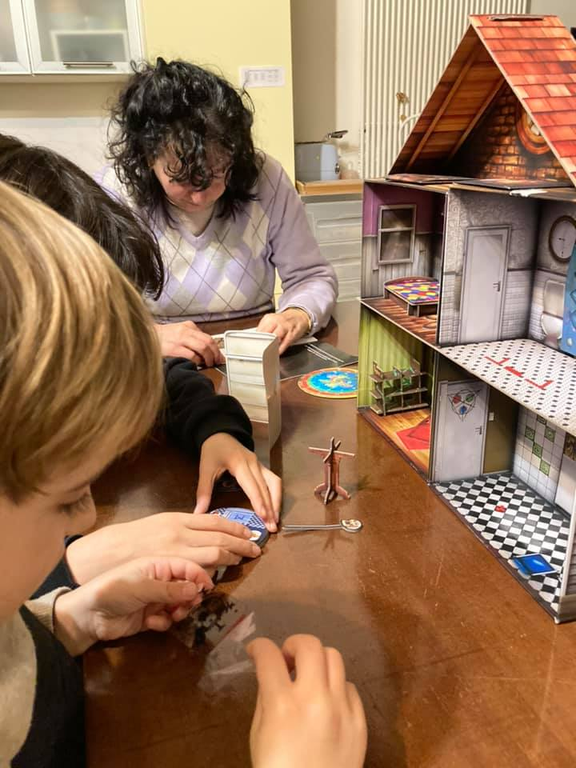

una escape the room ricorsiva!  
credo che a casa nostra abbiamo giocato  TUTTE le escape rooms possibili. e non potevano a mancare questa dove la scatola si trasforma nella casa fisica da cui bisogna scappare. 

insomma: chiusi in casa, evadiamo da una micro casa delle bambole 🙂

gli enigmi sono difficili. sapevamolo. ma mettendo una colonna sonora paurosa (consigliata da ThinkFun nel loro sito) la serata passa veloce.

