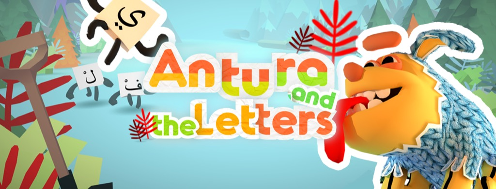

Il videogioco multipremiato per insegnare ai bambini siriani a leggere l'arabo.

Nel 2017 con [Videogames Without Borders](https://www.vgwb.org) in collaborazione con il [Cologne Game Lab,](http://www.colognegamelab.de/) abbiamo creato un prototipo per partecipare ad un bando internazionale per crare un videogioco che potesse dare **supporto psicologico ed educativo ai bambini siriani**. 

Abbiamo poi vinto tutte le fasi, allargando il team di sviluppo fino ad essere in 30 distribuiti in tutta Europa, Marocco e Libano, e a marzo 2018 siamo stati premiati durante la Mobile Learning Week dell'UNESCO, e in seguito una dozzina di altri premi in ambito Serious Games, Educational Game e Humanitarian Game.

Il gioco è totalmente open-source ([GitHub](https://github.com/vgwb/Antura_arabic), progettato e realizzato con la massima cura e test "sul campo", nei campi profughi e nei centri dei rifugiati in europa.

Stiamo tutt'ora lavorando a delle evoluzioni del gioco, per insegnare inglese, francese, marocchino, e presto Pastho e Farsi, in diverse nazioni del mondo.

Sono molto orgoglioso di questo progetto, di cui ho curato molti aspetti in tutte le sue fasi di produzione e coordinamento.

Il sito ufficiale del gioco è <http://antura.org>
