- cosa stai facendo?
- sto creando il mio regalo di compleanno per Bruno
- ma .. quella è la mappa del nostro giardino.. e quello è LibroGameCreator!
- già
- e poi cosa ne facciamo?
- lo stampiamo!
- ma il compleanno è fra un mese!
- ho già fatto tutto l'alberatura.. se mi aiuti con i disegni e la stampa ce la possiamo fare
- roger. facciamo squadra

e così, a inizio ottobre Fabio si mette a creare quello che diventerà **BuboLibro: un regalo speciale**, che qui vi presentiamo in anteprima

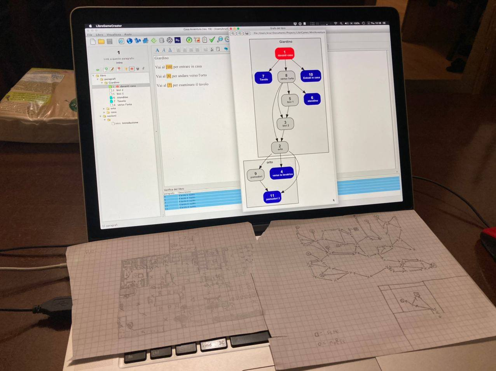

tutti abbiamo giocato ad un _LibroGame_, vero? ovvero un libro dove il lettore può prendere delle decisioni.
due anni fa tenni un laboratorio per bambini piccoli dove spiegare come creare un libro di 12 pagine, partendo da una struttura ad albero. ebbe grande successo (ne parlerò). Fabio aveva assimilato bene il tutto. anzi mi aveva pure aiutato, dato che già a 7 anni avevamo creato insieme dei videogiochi narrativi. la dimensione cartacea però ci mancava.

Essendo un libro da dare in mano ad un bambino di 5 anni che non sa ancora leggere, se non i numeri, il libro doveva essere senza troppe cose da leggere: figure e numeri.
per questo dopo qualche giorno gli feci abbandonare il seppur ottimo programma [LibroGameCreator](http://www.matteoporopat.com/librogame/libro-game-creator-3/) perché non supportava le immagini, e gli spiegai come usare [Obsidian](https://obsidian.md/), un editor gratuito di testi "collegati" dove è facilissimo inserire immagini, rendendo anche ancora più facile mettere tutto il progetto in OpenSource su GitHub così da poter collaborare io e lui facilmente (anticipo che il repository è [qui](https://github.com/StefanoCecere/BuboLibro_RegaloSpeciale/)) e sopratutto condividerlo con il mondo per ispirare altri a crearne magari uno proprio. Ok siamo dei romantici e ci illudiamo che c'è della creatività in ognuno di noi, basta solo trovare il momento e il calcio in culo giusto per ritirarla fuor

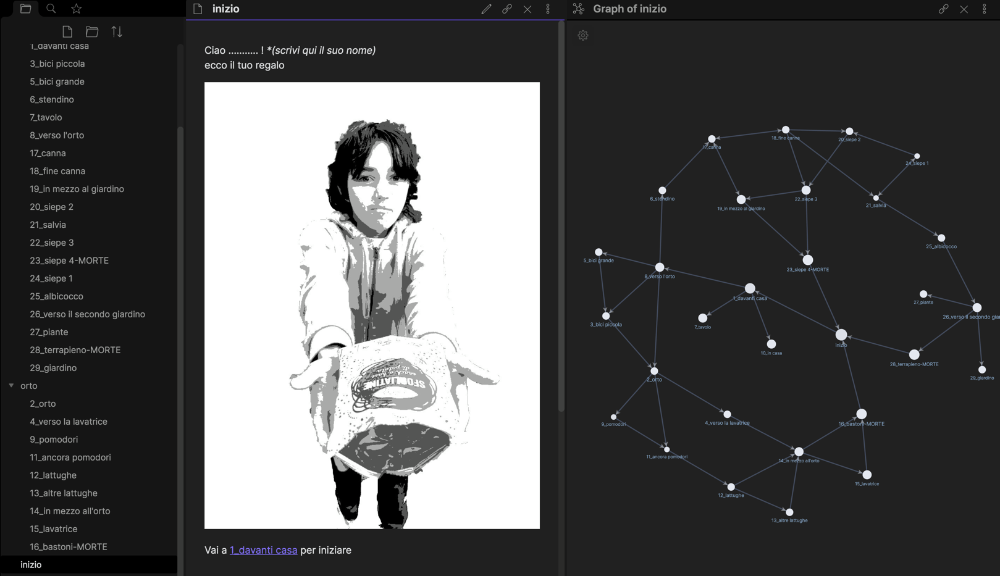

E così Fabio inizia a creare l'avventura sopra la mappa che aveva ricostruito.
ma come fare tutti i disegni?
la soluzione più veloce è stata.. fare le fotografie! e poi con un effetto computer farle sembrare disegnate a mano.. così avevamo tre vantaggi:
1. si potevano creare velocemente le pagine da testare
2. le avremmo potute ridisegnare per bene una volta finito il libro
3. il fratello conoscendo l'ambiente può capire la relazione mappa disegnata <-> spazio reale
4. se qualcuno volesse creare un suo libro avventura ispirandosi a questo, lo può fare senza troppa fantasia creativa!
5. lo so avevo scritto tre e ora siamo già a cinque
   
e così vanno avanti i giorni e ci lavora nel tempo libero... io lo aiuto ogni tanto nel testare i collegamenti, i testi, e inizio a pensare a come "stampare" il libro una volta finito il canovaccio
Sono in questi casi che avere un computer portatile proprio è fondamentale!

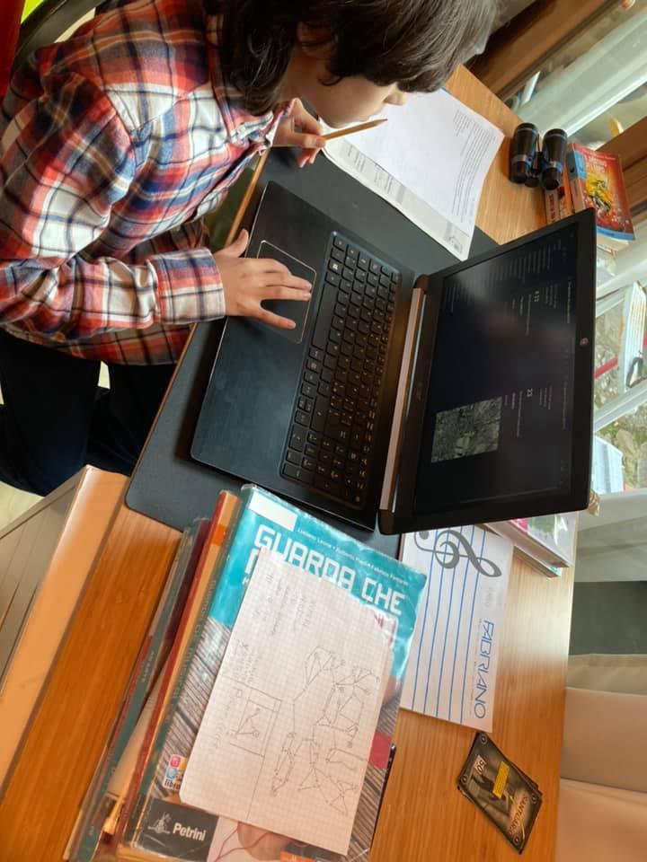

La sua dedizione è tale che appena scopro l'avvio di un [Corso di creazione di LibriGame](https://tambucreate.com/it/librogame), ci iscriviamo e il sabato mattina iniziamo a seguire i vari interventi mentre si lavora. io molte cose le sapevo già, ma lui no! sopratutto è interessante avere una percezione di quello che esiste, in questo caso delle tipologie di libri gioco esistenti, e della storia di come siamo arrivati fino a qui

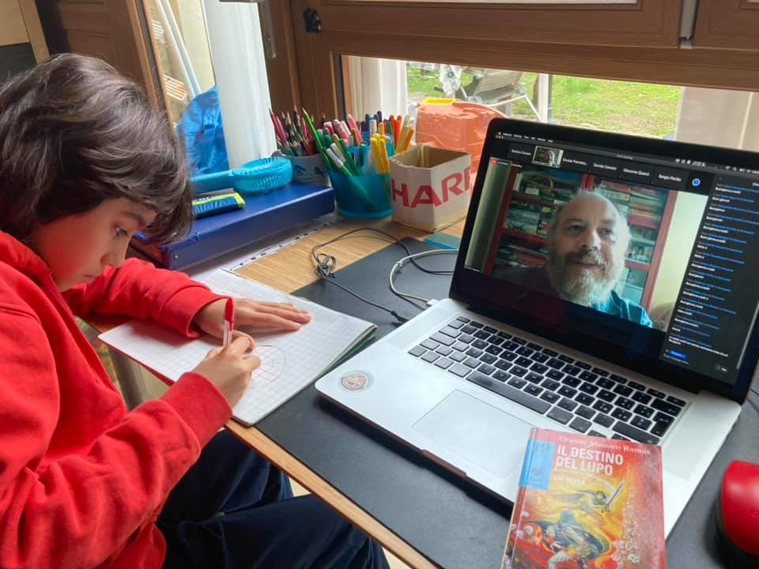

dopo qualche settimana la mappa è cresciuta.. alla semplice "navigazione" tra i nodi pagina e punti di "morte" si sono aggiunti un sistema di punti vita, così che non si muoia mai ma si possono guadagnare cuoricini se si fanno cose simpatiche, o perderli se si fanno birbonate (tipo toccare una sega arrugginita o sporgersi dal tetto). l'esperienza di creatore di videogiochi ha portato Fabio a inserire qualche oggetto da trovare per poter sbloccare alcune situazioni, delle locazioni segrete (con il numerino un po' mimetizzato).. e altre chicche che scoprirete :)

ecco la mappa finale.  
NB: costruire l'avventura con una mappa che si visualizza in tempo reale aiuta molto: si vedono i punti ciechi, i riferimenti sbagliati, la proporzione delle zone... e poi è divertente!

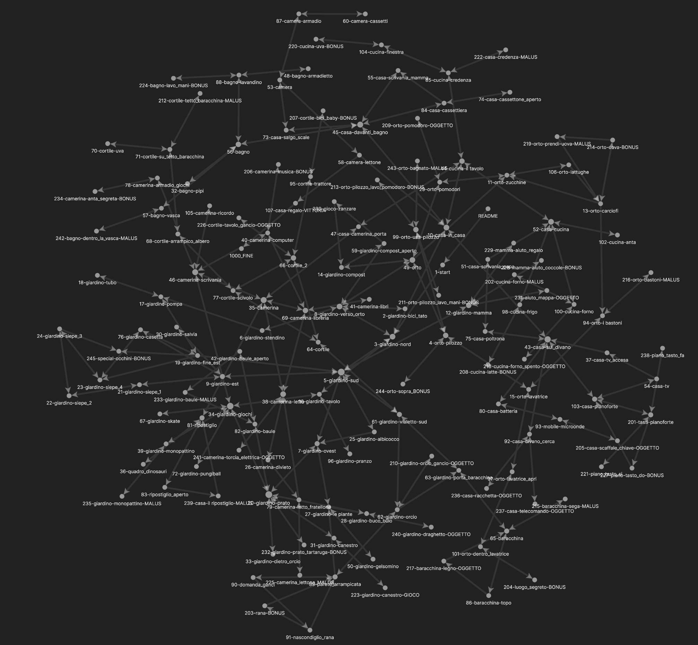

intanto io inizio a trovare il modo di impaginare il libro per stamparlo.
perché essendo un libro da regalare, e sopratutto il target bambino, lo volevamo in carta (una versione digitale non ci piaceva).
Tolgo la ruggine dalle mie vecchie capacità di impaginatore di libri (quindi anni fa editavo e stampavamo una [rivista](https://stefanocecere.github.io/ilfannullone.it/) e InDesign era il mio pane) e si inizia.
Tralascio i tecnicismi, fatto sta che si inizia a creare il PDF che poi porto in copisteria per una copia di prova.. siamo arrivati a circa **170 pagine** quindi ci consigliano una rilegatura ad anelli.. che poi risulterà congeniale.

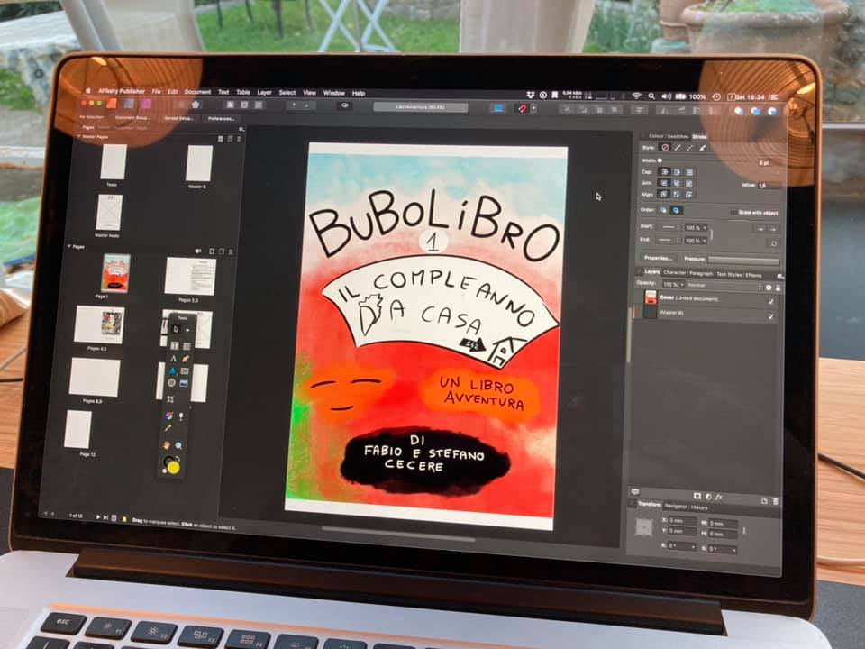

arrivata la prima stampa, è il momento di verificarla, che vuol dire giocare tutta l'avventura per scovare errori di collegamenti, di testo, di illeggibilità etc.

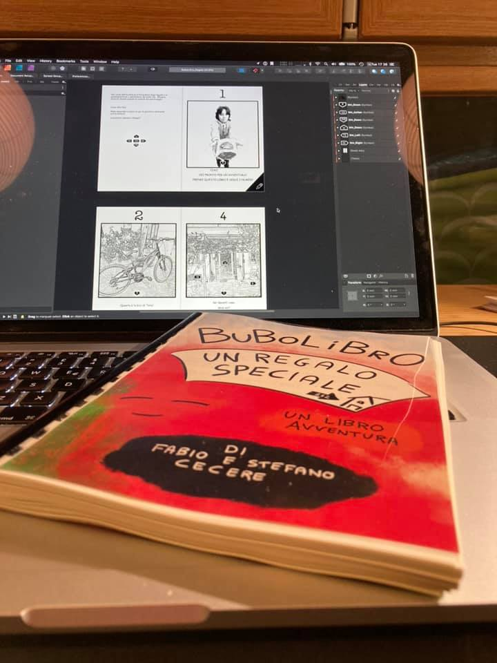

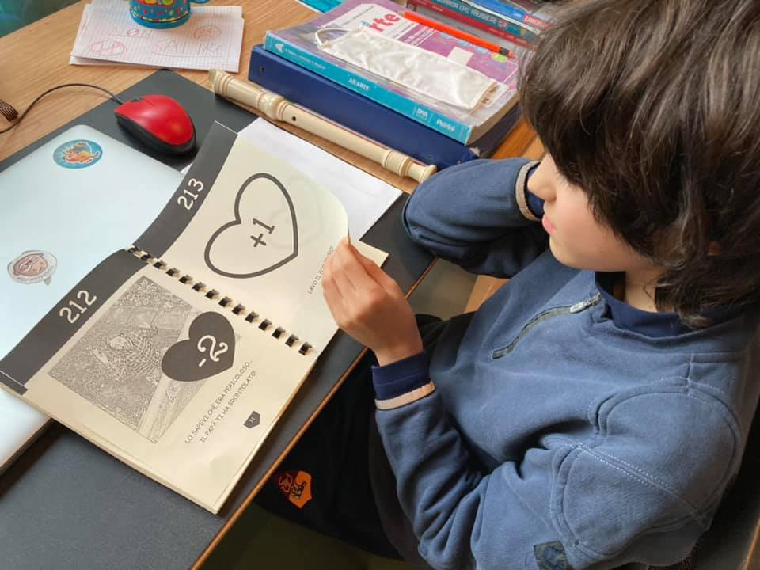

è davvero un bellissimo libro!
facciamo le correzioni varie e ci prepariamo a far stampare la versione finale, ma poi tra lockdowns (siamo in piena epidemia COVID) e quarantene varie salta la festa di compleanno vera e propria di Bruno e così un giorno decidiamo di regalargli la versione di prova e di giocarla in famiglia.

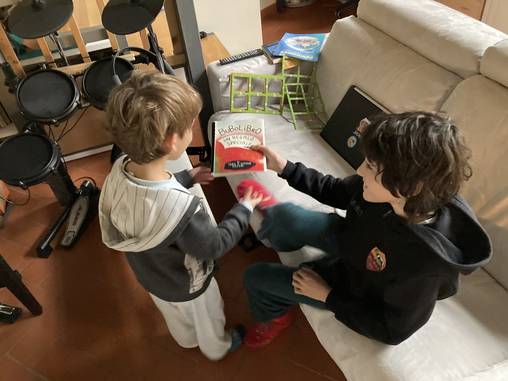

la lettura accompagnata è molto emozionante. anche se presto Bruno impara a navigare il libro in autonomia. In effetti era già abituato a videogiochi di avventura "punta e clicca" sul tablet e qui si trova già a suo agio)

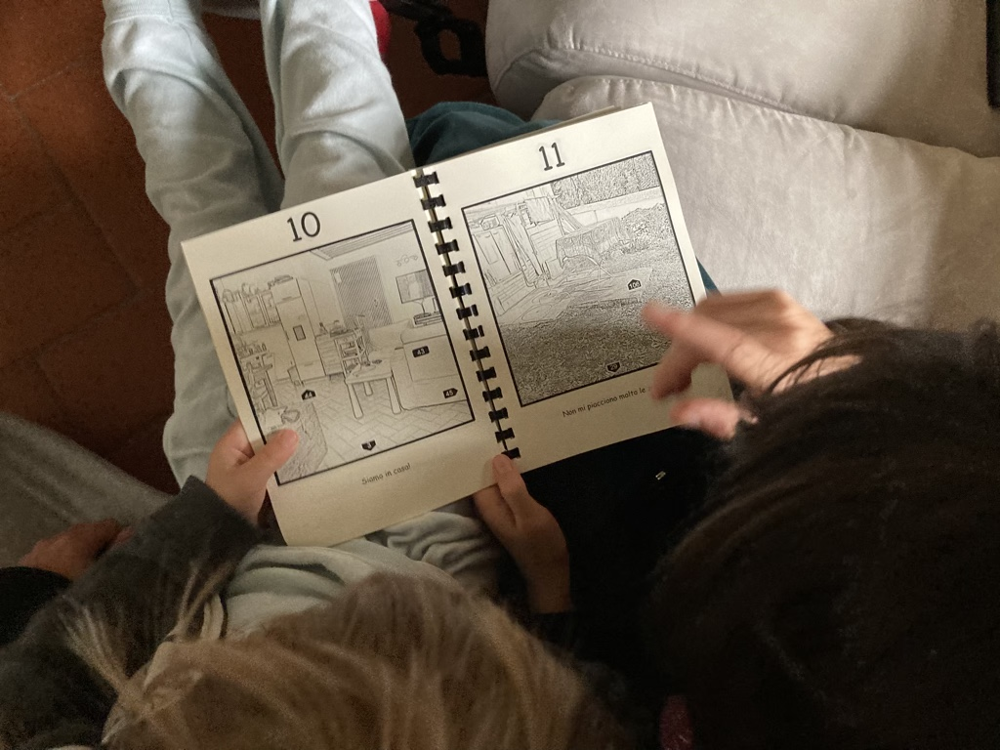

la cosa sorprendente è che avevamo lasciato della pagine "customizzabili" dove il lettere può inserire il nome del proprio bambino/a e messaggi vari.. oltre che regali. e giocando il libro avventura poi si può ritrovare una corrispondenza nel mondo reale..e così ha trovato i suoi regali di compleanno "speciali"

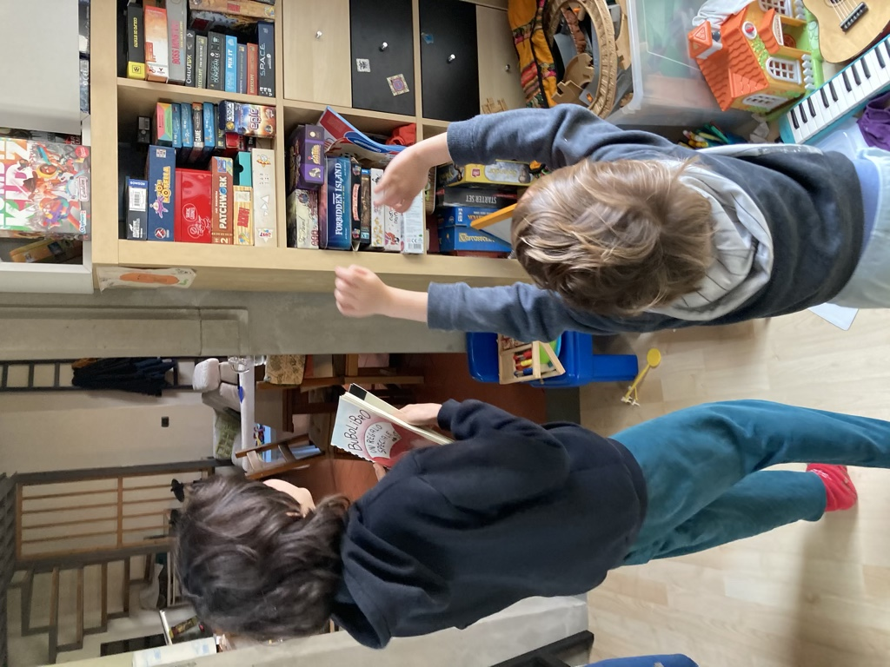

un aneddoto divertente.. quando nel libro va dalla mamma che può dare aiuto.. gli chiediamo: "cosa vuoi chiedere alla mamma?"
lui risponde: **come stai?** :)

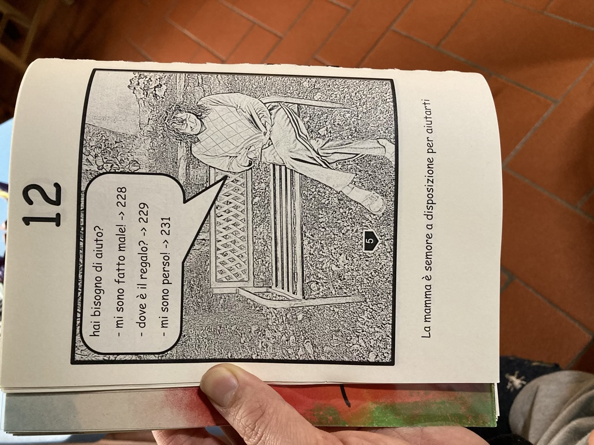

e così eccoci qui a scrivere questo post per raccontarvi il progetto.  
magari qualcuno di voi potrebbe volerne creare uno simile come regalo per un regalo speciale, chissà. fatemi sapere!
tutto il progetto è su GitHub qui: [https://github.com/StefanoCecere/BuboLibro_RegaloSpeciale](https://github.com/StefanoCecere/BuboLibro_RegaloSpeciale/)

se volete scaricare il PDF è qui: [PDF](https://github.com/StefanoCecere/BuboLibro_RegaloSpeciale/blob/master/_output/BuboLibro_Regalo_web.pdf)

su Facebook io scrivo sempre molto di quello che facciamo e con l'hashtag #bubolibro potete trovare un po' di post: 
<https://www.facebook.com/hashtag/bubolibro>

spero che il progetto vi sia piaciuto.. e .. stay tuned.. perchè questo è solo il numero 1 della serie BuboLibro! ;)

ah: se prendete spunto o copiate qualcosa.. citate almeno Fabio.. gli farebbe davvero piacere
