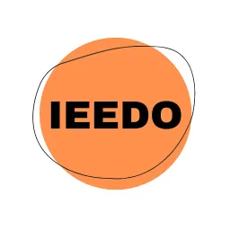

Adult education plays a critical role in helping refugees overcome barriers and find prosperity in their new communities. Gaining the knowledge and tools to face these barriers is key to securing long-term employment and to their overall well-being.

Using innovative game based learning methodologies, the Erasmus+ funded IEEDO project aims to reduce the disparity refugees and humanitarian migrants currently face in European adult education, helping them to develop skills and knowledge for digital self-learning. Thus, building resilience through innovative customised eLearning resources. The project will also support adult/ community education providers and tutors, to reduce the disparity individuals face in European adult education.

Project Partners:

- Ashley Community Housing (United Kingdom)
- Folkuniversitetet (Sweden)
- MetropolisNet (Germany)
- Rinova Ltd (United Kingdom)
- Dimitra (Greece)
- Video Games Without Borders (Spain)

Funded by the European Union. Views and opinions expressed are however those of the author(s) only and do not necessarily reflect those of the European Union or the European Education and Culture Executive Agency (EACEA). Neither the European Union nor EACEA can be held responsible for them.

Read more on the official website of the project: https://euieedo.wordpress.com/about/

Check out the Open Spurce code and documentation on Github: https://vgwb.github.io/IEEDO/

<https://ieedo.vgwb.org/app/>
