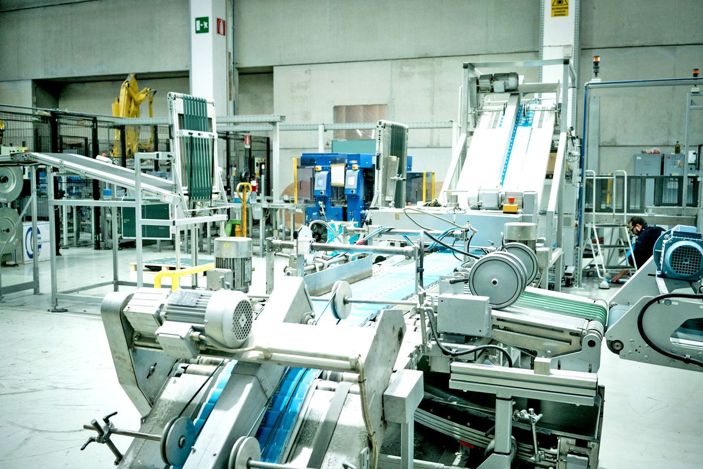

🟧 loro non avrebbero mai potuto imparare a farlo...

sembra ieri che liceale prendevo la bicicletta (quando non mi accompagnava mia mamma in macchina) per andare in Tipografia.  
la storica Officine Grafiche "Piffarerio" di Monza.
grandi lavoratori con la barba alla Marx (ciao Gianni) ma che di computer non ci capivano niente.
dovevano stampare indirizzi su centinaia di migliaia di buste e per questo avevano comprato (o avevano venduto loro) una marcatrice a getto d'avanguardia, con tanto di PC DOS e lettore di giganti bobine magnetiche, le famose "pizze" che contenevano tutti i dati.
una macchina "extraterrestre".
e come programmare il PC a leggere quei dati e gestire le pistole che stampavano collegate alle fotocellule?
👉🏼 loro non avrebbero mai potuto imparare a farlo.
ma un loro cliente (ciao Doriano) segnalò loro un ragazzetto che già programmava i videogiochi sull'Amiga... sicuramente ci avrebbe capito...
e così iniziai le mie avventure nelle Tipografie, a passare molte ore tra le macchine e le esalazioni degli inchiostri, i rulli che si inceppavano, i percorsi che dovevano fare tutte quelle buste (Infinifactory ciao) ma sopratutto capire quando una pizza di dati non andava bene e parlare con il loro fornitore o programmare una patch.
e quando mi portarono nella ditta di Melzo che produceva quella stampante a fare un corso di formazione, gli ingegneri pensavano fosse il signore con la barba lunga a dover imparare, invece era il ragazzino magro dalla testa grossa.
ricordo anche che mi pagavano 50.000 lire all'ora. era tanto per me. ma Piffarerio diceva che era il compenso giusto perché era un lavoro importante, di valore.
negli anni tornai più volte a lavorare nelle tipografie e nelle case editrici.
ma questa fu la mia vera "iniziazione" nel mondo del lavoro, a stretto contatto con gli operai (lì intuii cosa fosse l'alienazione della catena automatizzata)
avevo 17 anni e non smisi più di lavorare con le tecnologie editoriali d'avanguardia.

morale: lungi da me condividere la biografia di una persona comune, mi interessa ricordarmi che ognuno vive in un mondo dettato da moltissimi parametri, credenze, modi di fare. e quando arriva un'"innovazione" non è scontato che venga accolta e compresa nello stesso modo. qualcuno non ha neanche le basi concettuali per potersi avvicinare.
PS: ho cercato in tutti i modi qualche foto di quella macchina.. ma nonostante fosse il 1990 non ho trovato nulla, queste foto però richiamano l'atmosfera 🙁
