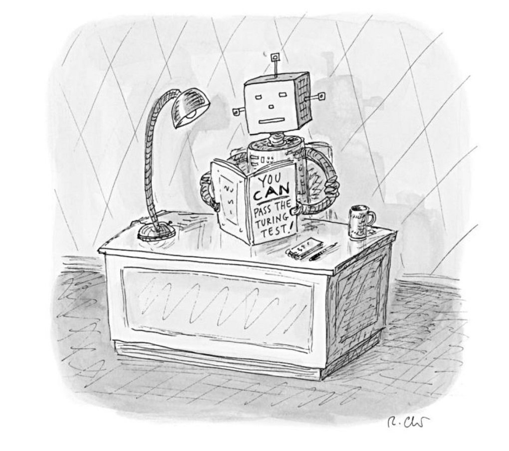
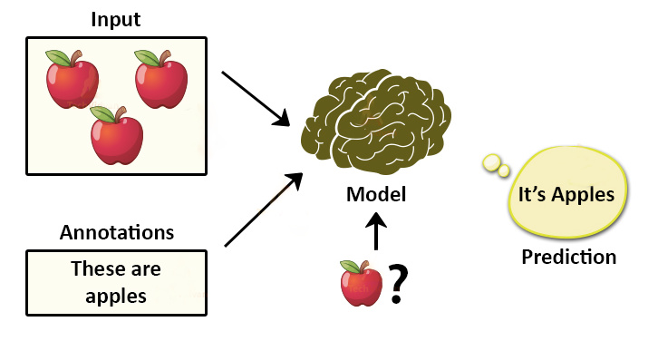
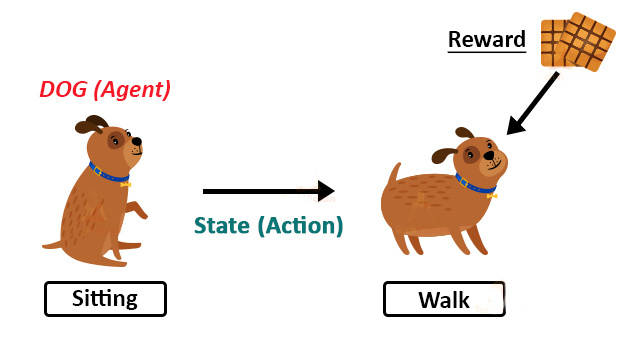
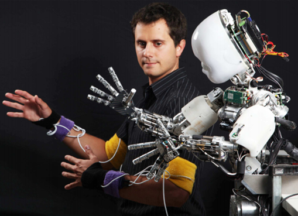
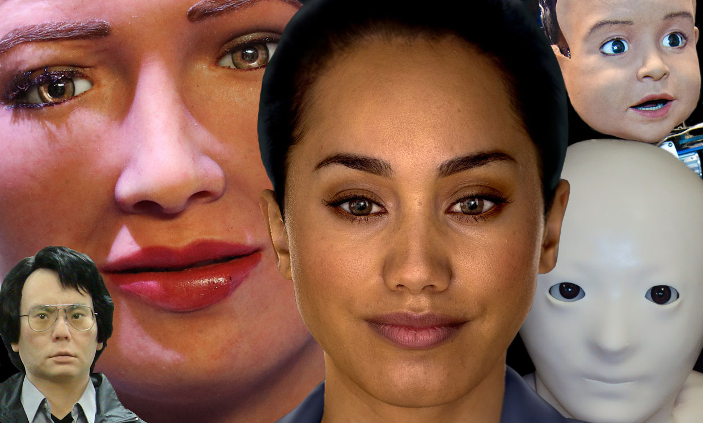
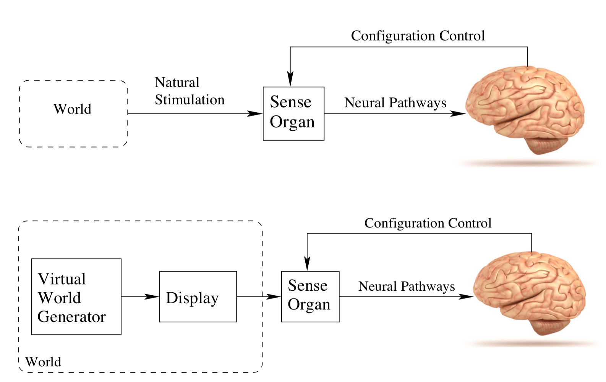
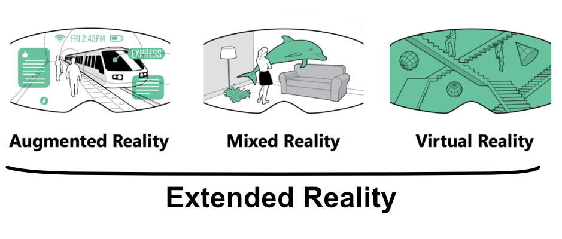

### L’umanesimo nell’intelligenza artificiale, nella realtà virtuale e nei videogiochi

Stefano Cecere

---

##### Videogiochi
1. medium del nuovo millennio
2. medium "umanista"
3. sviluppare: AI e VR

---

##### Il circuito



---

##### Multiplayer

---

##### Non solo entertainment

---

##### Un medium umano-centrico

---

##### Intelligenza Artificiale


---

##### Machine Learning

---

Supervised Learning

---

Reinforced Learning

---

#### Imitation Learning

---

### Umanizzazione digitale

---

### Dati, opinioni e comportamento

---

### Illusioni e creatività

---

### Etica ed essere umani

---

## Realtà Virtuale

|Sense|Stimulus|Receptor|Sense Organ|
|---|---|---|---|
|Vision|Electromagnetic energy|Photoreceptors|Eye|
|Auditory|Air pressure waves|Mechanoreceptors|Ear|
|Touch|Tissue distortion|Mechanoreceptors, Thermoreceptors|Skin, muscles|
|Balance|Gravity, acceleration|Mechanoreceptors| Vestibular organs
|Taste/Smell|Chemical composition|Chemoreceptors|Mouth, Nose|

---

### Empatia

---

## VR sociale

---

### Realtà Aumentata

---

### Connessioni neurali e reale/irreale

---

## Il game designer

---

grazie
https://stefano.cecere.org
