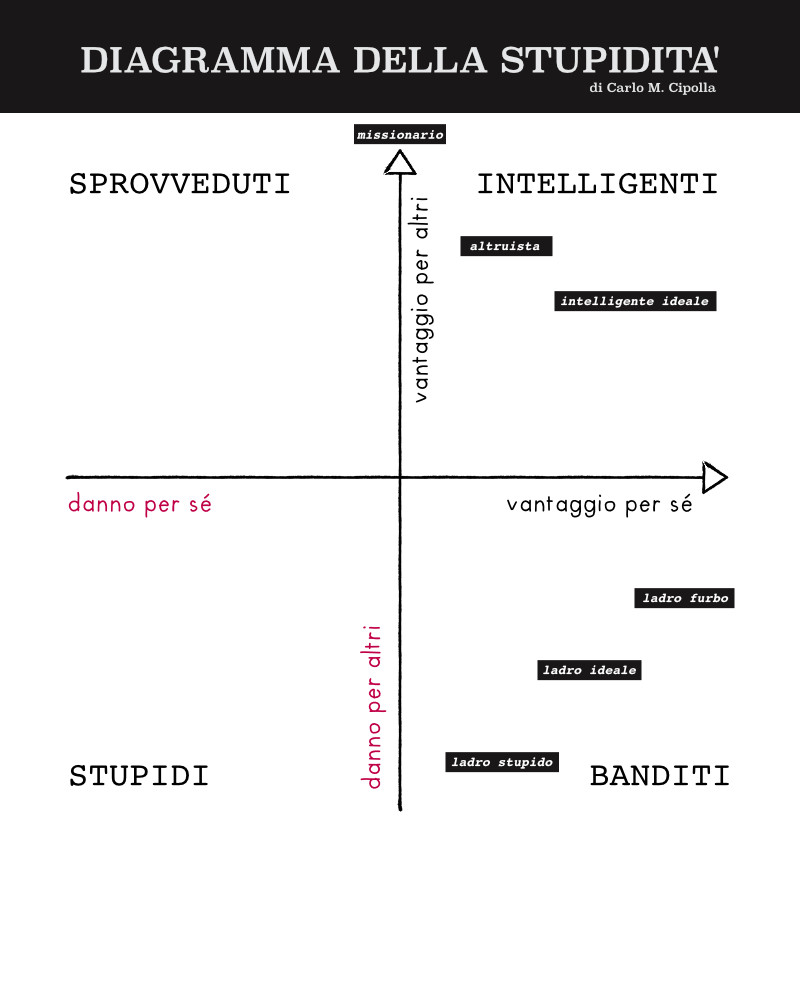

Non so voi, ma anelo molto alla ricerca dell'Intelligenza in tutte le sue forme.
Per questo inizio sempre tutte le mie lezioni e workshop con un accenno al Diagramma della Stupidità, tratto da quel piccolo ma intenso capolavoro che è "Allegro ma Non Troppo" scritto nel 1988 da [Carlo Cipolla](https://it.wikipedia.org/wiki/Carlo_M._Cipolla).

In pratica: stupido è non tanto chi lo stupido fa, ma chi con le proprie azioni arreca danno tanto agli altri quanto a sé stesso.

Intelligente è invece chi procura beneficio sia agli altri che a sé stesso.

E' una definizione abbastanza particolare di intelligenza..che esclude i geni del male ("banditi") ed incorpora una certa morale ed etica, uno sguardo verso l'altro e il futuro, ed è particolarmente facile e divertente da ricordare.

Credo sia molto interessante meditare su questo schema, sopratutto per chi aspira a posizionarsi nel quadrante superiore (portare beneficio agli altri) e cercando di evitare di diventare sprovveduti. ai ragazzi piace molto.

## Prima Legge
**Sempre e inevitabilmente ognuno di noi sottovaluta il numero degli individui stupidi in circolazione:**

1. persone che reputiamo razionali ed intelligenti all’improvviso risultano essere stupide senza ombra di dubbio

2. giorno dopo giorno siamo condizionati in qualunque cosa che facciamo da gente stupida che invariabilmente compaiono nei luoghi meno opportuni

E’ impossibile stabilire una percentuale, dato che qualsiasi numero sarà troppo piccolo.

## Seconda Legge
**La probabilità che una certa persona sia stupida é indipendente da qualsiasi altra caratteristica della stessa persona, spesso ha l'aspetto innocuo/ingenuo e ciò fa abbassare la guardia.**  
Se studiamo la percentuale di stupidi fra i bidelli che puliscono le classi dopo che se ne sono andati alunni e maestri, scopriremo che è molto più alta di quello che pensavamo. Potremmo supporre che è in relazione con il basso livello culturale o col fatto che le persone non stupide hanno maggiori opportunità di avere buoni lavori. Però se analizziamo gli studenti ed i professori universitari (o i programmatori di software) la percentuale è esattamente la stessa.
Le femministe militanti potranno arrabbiarsi, ma la percentuale di stupidi è la stessa in ambo i sessi (o in tutti i sessi a seconda di come si considerano).
Non si può trovare nessuna differenza del fattore Y nelle razze, condizioni etniche, educazione, eccetera.

## Terza Legge
**Una persona stupida è chi causa un danno ad un altra persona o gruppo di persone senza nel contempo realizzare alcun vantaggio per sé o addirittura subendo una perdita.**

## Quarta Legge
**Le persone non stupide sottovalutano sempre il potenziale nocivo delle persone stupide.**  
Dimenticano costantemente che in qualsiasi momento, e in qualsiasi circostanza, trattare e/o associarsi con individui stupidi si dimostra infallibilmente un costosissimo errore.

## Quinta Legge
**La persona stupida é il tipo di persona più pericolosa che esista.** 

Questa è probabilmente la più comprensibile delle leggi per la conoscenza comune che la gente intelligente, per quanto possano essere ostili, sono prevedibili mentre gli stupidi non lo sono. 

## Corollario
Inoltre il suo Corollario di base: **"Una persona stupida è più pericolosa di un bandito"** ci conduce all’essenza della Teoria del Cipolla. 
Esistono quattro tipi di persone in dipendenza del loro comportamento in una transazione:

- **Sprovveduto**: chi con la sua azione tende a causare danno a sé stesso, ma crea anche vantaggio a qualcun altro
- **Intelligente**: chi con la sua azione tende a creare vantaggio per sé stesso, ma crea anche vantaggio a qualcun altro
- **Bandito**: chi con la sua azione tende a creare vantaggio per sé stesso, ma allo stesso tempo danneggia qualcun altro
- **Stupido**:  chi causa un danno ad un altra persona o gruppo di persone senza nel contempo realizzare alcun vantaggio per sé o addirittura subendo una perdita

